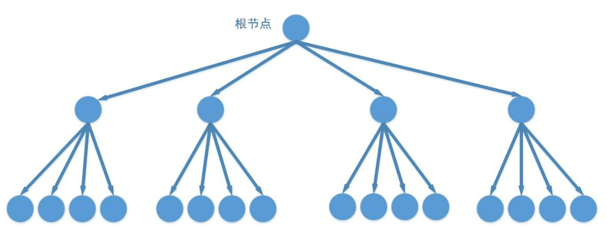

# 前提摘要

作为程序员，应该都对二叉树都不陌生，我们都知道二叉树的变体二叉查找树，非常适合用来进行对一维数列的存储和查找，可以达到 `O(logn)` 的效率；我们在用二叉查找树进行插入数据时，根据一个数据的值和树结点值的对比，选择二叉树的两个叉之一向下，直到叶子结点，查找时使用二分法也可以迅速找到需要的数据。

但二叉树只支持一维数据，如一个标量数值，对地图上的位置点这种有xy两个方向上的信息却无能为力，那么是否有一种树能够支持二维数据的快速查询呢？

# 四叉树

> 四元树又称四叉树是一种树状数据结构，在每一个节点上会有四个子区块。四元树常应用于二维空间数据的分析与分类。它将数据区分成为四个象限。

> 使用案例：比如记这个笔记的我，现在正在学习四叉树去实现2D面板上多个object之间的碰撞检测。

今天要介绍的四叉树可以认为是二叉查找树的高维变体，它适合对有二维属性的数据进行存储和查询，当然四叉树存储的也不一定是二维数据，而是有着二维属性的数据，如有着 x,y 信息的点，用它还可以用来存储线和面数据。它有四个`叉`，在数据插入时，我们通过其二维属性（一般是 x,y）选择四个叉之一继续向下，直至叶子结点，同样使用“四分法”来迅速查找数据。四叉树的一般图形结构如下：

# 使用途径

四叉树常见的应用有

* 图像处理、
* 空间数据索引、
* 2D中的快速碰撞检测、
* 稀疏数据等，

今天我们很纯粹地只介绍它在空间索引方面的应用。

根据其存储内容，四叉树可以分为``点四叉树``、``边四叉树``和``块四叉树``，今天我们实现的是点四叉树。

根据其结构，四叉树分为满四叉树和非满四叉树。

对于满四叉树，每个节点都有四个子结点，它有着固定的深度，数据全都存在最底层的子结点中，进行数据插入时不需要分裂。

满四叉树在确定好深度后，进行插入操作很快，可是如果用它来存储下图所示数据，我们会发现，四叉树的好多叉都是空的，当然它们会造成内存空间的大量浪费。

---

部分文本摘抄于

* https://www.cnblogs.com/zhenbianshu/p/7061550.html