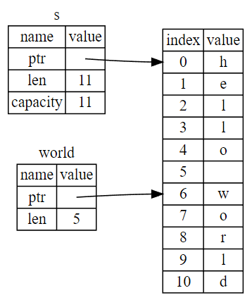

# Slices
*Slices* let you reference a contiguous sequence of elements in a collection rather than the whole collection. **A slice is a kind of reference, so it does not have ownership.**

> note: The rust offical book illustrate an example about why slices are useful in Rust. I truncated the example and jump right into the next part.

## String Slices
A string slice is a reference to part of a `String`, and it looks like this:
```rust
let s = String::from("hello world");
let hello = &s[0..5];
let world = &s[6..11];
```



With Rust’s `..` range syntax, if you want to start at index `0`, you can drop the value before the two periods. In other words, these are equal:
```rust
let s = String::from("hello");
let slice = &s[0..2];
let slice = &s[..2];
```

By the same token, if your slice includes the last byte of the `String`, you can drop the trailing number. That means these are equal:
```rust
let s = String::from("hello");

let len = s.len();
let slice = &s[3..len];

let slice = &s[3..];
```

You can also drop both values to take a slice of the entire string. So these are equal:
```rust
let s = String::from("hello");

let len = s.len();
let slice = &s[0..len];

let slice = &s[..];
```

> Note: String slice range indices must occur at valid UTF-8 character boundaries. If you attempt to create a string slice in the middle of a multibyte character, your program will exit with an error. **For the purposes of introducing string slices, we are assuming ASCII only in this section**; a more thorough discussion of UTF-8 handling will be introduced later.

### Example
Take the following example, an compile-time error will occur:
```rust
fn main() {
    let mut s = String::from("hello world");

    let word = borrow_a_string(&s);

    s.clear(); // ❌ WON'T COMPILE

    println!("the word is: {}", word);
}

fn borrow_a_string(s: &String) -> &String {
    s
}
```
Here's the compiler error:
```bash
error[E0502]: cannot borrow `s` as mutable because it is also borrowed as immutable
 --> src\main.rs:6:5
  |
4 |     let word = borrow_a_string(&s);
  |                                -- immutable borrow occurs here
5 |
6 |     s.clear(); // error!
  |     ^^^^^^^^^ mutable borrow occurs here
7 |
8 |     println!("the first word is: {}", word);
  |                                       ---- immutable borrow later used here  
```
Recall from the borrowing rules that if we have an immutable reference to something, we cannot also take a mutable reference. Because `clear` needs to truncate the `String`, it needs to get a mutable reference. The `println!` after the call to clear uses the reference in `word`, so the immutable reference must still be active at that point. Rust disallows the mutable reference in `clear` and the immutable reference in `word` from existing at the same time, and compilation fails. 

> Not only has Rust made our API easier to use, but it has also eliminated an entire class of errors at compile time!

# String Literals as Slices
Recall that we talked about string literals being stored inside the binary. Now that we know about slices, we can properly understand string literals:
```rust
let s = "Hello, world!";
```
The type of `s` here is `&str`: it’s a slice pointing to that specific point of the binary. This is also why string literals are immutable; `&str` is an immutable reference.

# Other Slices
String slices, as you might imagine, are specific to strings. But there’s a more general slice type too. Consider this array:
```rust
let a = [1, 2, 3, 4, 5];
```

Just as we might want to refer to part of a string, we might want to refer to part of an array. We’d do so like this:
```rust
let a = [1, 2, 3, 4, 5];
let slice = &a[1..3];
assert_eq!(slice, &[2, 3]);
```

This slice has the type `&[i32]`. It works the same way as string slices do, by storing a reference to the first element and a length. You’ll use this kind of slice for all sorts of other collections. We’ll discuss these collections in detail in later chapters.

# Summary
The concepts of ownership, borrowing, and slices ensure memory safety in Rust programs at compile time. The Rust language gives you control over your memory usage in the same way as other systems programming languages, but having the owner of data automatically clean up that data when the owner goes out of scope means you don’t have to write and debug extra code to get this control.

Ownership affects how lots of other parts of Rust work, so we’ll talk about these concepts further throughout the rest of the book. Let’s move on 5 and look at grouping pieces of data together in a `struct`.