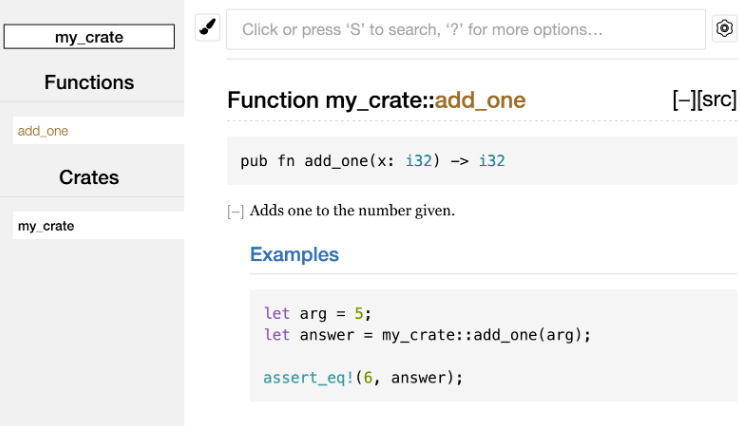

# Making Useful Documentation Comments
Rust also has a particular kind of comment for documentation, known conveniently as a **documentation comment**, that will generate HTML documentation. 
> The HTML displays the contents of documentation comments for public API items intended for programmers interested in knowing how to use your crate as opposed to how your crate is *implemented*.

Documentation comments use three slashes, `///,` instead of two and support Markdown notation for formatting the text. Place documentation comments just before the item they’re documenting:
```rust
/// Adds one to the number given.
///
/// # Examples
///
/// ```
/// let arg = 5;
/// let answer = my_crate::add_one(arg);
///
/// assert_eq!(6, answer);
/// ```
pub fn add_one(x: i32) -> i32 {
    x + 1
}
```

For convenience, running `cargo doc --open` will build the HTML for your current crate’s documentation (as well as the documentation for all of your crate’s dependencies) and open the result in a web browser:



# Commonly Used Sections
Here are some sections that crate authors commonly use in their documentation:
* **Panics**: The scenarios in which the function being documented could panic. Callers of the function who don’t want their programs to panic should make sure they don’t call the function in these situations.
* **Errors**: If the function returns a `Result`, describing the kinds of errors that might occur and what conditions might cause those errors to be returned can be helpful to callers so they can write code to handle the different kinds of errors in different ways.
* **Safety**: If the function is `unsafe` to call (we discuss unsafety in later chapters), there should be a section explaining why the function is unsafe and covering the invariants that the function expects callers to uphold.

> Most documentation comments don’t need all of these sections, but this is a good checklist to remind you of the aspects of your code users will be interested in knowing about.

# Documentation Comments as Tests
Adding example code blocks in your documentation comments can help demonstrate how to use your library, and doing so has an additional bonus: running cargo test will run the code examples in your documentation as tests!
> Nothing is better than documentation with examples. But nothing is worse than examples that don’t work because the code has changed since the documentation was written.

If we run cargo test with the documentation for the `add_one` function:
```txt
   Doc-tests my_crate

running 1 test
test src/lib.rs - add_one (line 5) ... ok

test result: ok. 1 passed; 0 failed; 0 ignored; 0 measured; 0 filtered out; finished in 0.27s
```

# Commenting Contained Items
The style of doc comment `//!` adds documentation to the item that contains the comments rather than to the items following the comments. We typically use these doc comments inside the crate root file (`src/lib.rs` by convention) or inside a module to document the crate or the module as a whole.

# Re-exporting a Convenient Public API with `pub use`
The structure of your public API is a major consideration when publishing a crate. People who use your crate are less familiar with the structure than you are and might have difficulty finding the pieces they want to use if your crate has a large module hierarchy.

> The structure that makes sense to you while you’re developing a crate, but it might not be very convenient for your users. You might want to organize your structs in a hierarchy containing multiple levels, but then people who want to use a type you’ve defined deep in the hierarchy might have trouble finding out that type exists.

The good news is that if the structure *isn’t* convenient for others to use from another library, you don’t have to rearrange your internal organization: instead, you can re-export items to make a public structure that’s different from your private structure by using `pub use`. Re-exporting takes a public item in one location and makes it public in another location, as if it were defined in the other location instead.

## Example
For example, say we made a library named `art` for modeling artistic concepts:
```rust
//! # Art
//!
//! A library for modeling artistic concepts.

pub mod kinds {
    /// The primary colors according to the RYB color model.
    pub enum PrimaryColor {
        Red,
        Yellow,
        Blue,
    }

    /// The secondary colors according to the RYB color model.
    pub enum SecondaryColor {
        Orange,
        Green,
        Purple,
    }
}

pub mod utils {
    use crate::kinds::*;

    /// Combines two primary colors in equal amounts to create
    /// a secondary color.
    pub fn mix(c1: PrimaryColor, c2: PrimaryColor) -> SecondaryColor {
        unimplemented!();
    }
}
```
The following image shows what the front page of the documentation for this crate generated by `cargo doc would` look like:


* Note that the `PrimaryColor` and `SecondaryColor` types aren’t listed on the front page, nor is the `mix` function. We have to click `kinds` and `utils` to see them.

> Another crate that depends on this library would need `use` statements that bring the items from `art` into scope:
>
> ```rust
> // src/main/rs
> use art::kinds::PrimaryColor;
> use art::utils::mix;
> fn main() {
>     let red = PrimaryColor::Red;
>     let yellow = PrimaryColor::Yellow;
>     mix(red, yellow);
> }
> ```
>
> The author of the above code had to figure out the `PrimaryColor` is in the `kinds` module and `mix` is in the `utils` module.

To remove the internal organization from the public API, we can modify the `art` crate code as following:

```rust
//! # Art
//!
//! A library for modeling artistic concepts.
pub use self::kinds::PrimaryColor;
pub use self::kinds::SecondaryColor;
pub use self::utils::mix;
// ...
```

The API documentation that `cargo doc` generates for this crate will now list and link re-exports on the front page:


> The `art` crate users can still see and use the internal structure as following:
>
> ```rust
> // src/main/rs
> use art::mix;
> use art::PrimaryColor;
> fn main() {
>     // ...
> }
> ```

# Summary

Creating a useful public API structure is more of an art than a science, and you can iterate to find the API that works best for your users. Choosing `pub use` gives you flexibility in how you structure your crate internally and decouples that internal structure from what you present to your users. Look at some of the code of crates you’ve installed to see if their internal structure differs from their public API.
