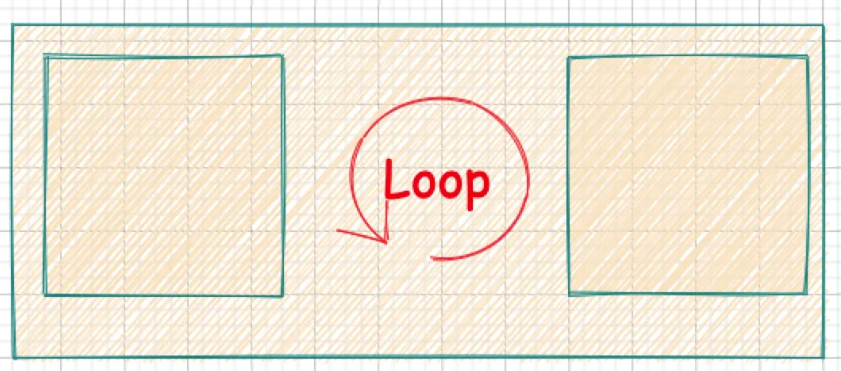
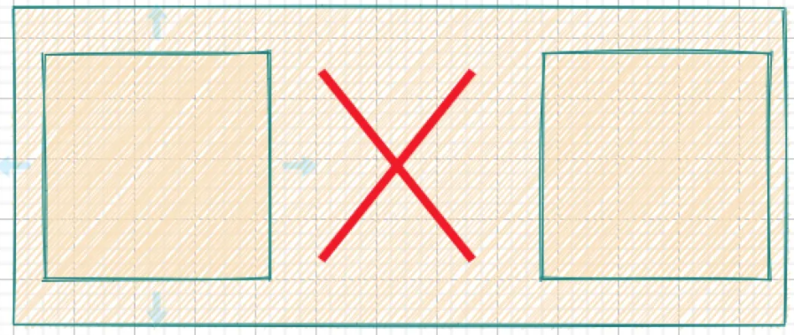
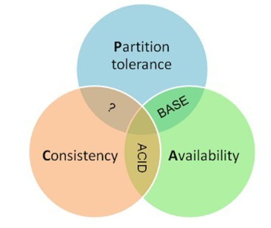
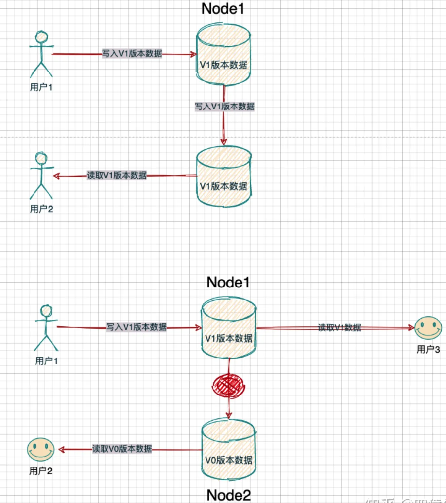

# CAP定理 - CAP Theorem

> 作者是University of California, Berkeley, 计算机科学家Eric Brewer提出的一个猜想，以“CAP定理”享誉IT理论界。
>
> Eric Brewer在1998年提出【CAP猜想】（Conjecture），1999年出版。在2002年由MIT的Seth Gilbert和Nancy Lynch给出了数学证明，从此正式地被命名为【CAP定理】（Theorem）。
> 
>
> **该定理对分布式系统的【架构设计】具有深刻影响。**但也存在大量的【误解】。很多人把该定理庸俗地理解为“三选二”，或者理解为“完全放弃 CAP 的其中一方”。
>
> > P.S. Nancy Lynch奶奶同时也写过一本《Distributed Algorithm》书籍广受好评。但因为该书中的算法证明涉及到大量的数学，读起来也绝对是困难中的困难。
> > 

> **P.S.** 接下来这篇笔记主要是对Brewer于2012年发表的文章“[CAP Twelve Years Later: How the "Rules" Have Changed](https://www.infoq.com/articles/cap-twelve-years-later-how-the-rules-have-changed/)”的摘抄及概述。还是强烈建议看一看英文原文。

## CAP的由来

要理解 CAP，首先我们要清楚，为何会有人提出 CAP？他提出 CAP 是为了解决什么问题？

时间回到 1985 年，彼时，后来证明了 CAP 理论的 Lynch 教授此时给当时的 IT 界来了一记惊雷：

* 她通过不可辩驳的证明告诉业界的工程师们，如果在一个不稳定（消息要么乱序要么丢了）的网络环境里（分布式异步模型），想始终保持数据一致是不可能的。

    

    

这是个什么概念呢？就是她打破了那些既想提供超高质量服务，又想提供超高性能服务的技术人员的幻想。这本质是在告诉大家，在分布式系统里，需要妥协。但是，如何妥协？分布式系统里到底应该怎么权衡这种 trade-off？

> 我们可以想象一下，在 CAP 定理提出之前，没有这些方向性的指引，在设计和实施分布式系统时该有多么混乱。一套分布式系统是由多个模块组成的，这些模块本身可能由不同的开发人员去完成。然而，对于这些人，在公共层面，竟然没有一个原则去指导他们该怎么完成这套功能。
>
> 比如，我们在同步两个节点的数据时，如果发生了错误，到底我们应该怎么做呢？如果没有统一的标准和方向，那很可能在一套分布式系统中的不同模块，会出现不同的处理情况。
>
> 假设一套系统，由 A、B 两个模块构成。A 模块的设计理念是：节点间出现了问题，它可能会选择不断的重试，一直等到节点通信恢复。
>
> 
>
> 而 B 的设计理念是：节点间出现了问题，它断开就是了，可能最多就记录下状态，等以后处理。
> 
> 
> 
> 可是，当 A、B 之间出现了通信怎么办？那会出现 A 往 B 发请求，出问题会不断重试。而 B 往 A 发请求，出问题则直接断开的情况。
>
> **当然，在后面我们会说明，CAP 的理念在实际工程中，会允许这种不一致。可是，那种不一致是提前设计好和规划好的，是根据实际数据的重要性和业务需求做的妥协，而不是这种混乱的妥协。**
>
> 所以，IT 界的人们就一直在摸索，试图找到一些纲领去指导分布式系统的设计，这一找就找了 15 年。
>
> 2000 年时，Eric Brewer 教授在 PODC 会议上提出了 CAP 理论，但是由于没有被证明过，所以，当时只能被称为 CAP 猜想。这个猜想引起了巨大的反响，因为 CAP 很符合人们对设计纲领的预期。
>
> 在 2002 年后，经过 Seth Gilbert 和 Nancy Lynch 从理论上证明了 CAP 猜想后，CAP 理论正式成为了分布式系统理论的基石之一。

## CAP理论概述

**一个分布式系统最多只能同时满足一致性（Consistency）、高可用性（Availability）和分区容忍性（Partition tolerance）这三项中的两项**。

> “The CAP theorem states that any networked shared-data system can have at most two of three desirable properties:
>
> - consistency (C) equivalent to having a single up-to-date copy of the data;
> - high availability (A) of that data (for updates);
> - tolerance to network partitions (P).”

1. 一致性（**C**onsistency）—— “Every read receives the most recent write or an error”（下面会细谈具体分类）
2. 高可用性（**A**valiability）—— “Every request receives a (non-error) response, without the guarantee that it contains the most recent write.”
3. 分区容忍性（**P**artition Tolerance）—— “The system continues to operate despite an arbitrary number of messages being dropped (or delayed) by the network between nodes.”

> “The CAP theorem asserts that any net­worked shared-data system can have only two of three desirable properties. How­ever, by explicitly handling partitions, designers can optimize consistency and availability, thereby achieving some trade-off of all three.” —— Eric Brewer

## 一致性（Consistency）

对于一致性，可以分为从客户端和服务端两个不同的视角：

- 客户端（client-side）: 一致性主要指的是多并发访问时更新过的数据如何获取的问题。
- 服务端（server-side）: 更新如何分布到整个系统，以保证数据最终一致。

对于一致性，可以分为强/弱/最终一致性三类。

### 强一致性 - Strong Consistency [^1]

* 对于关系型数据库，要求更新过的数据能被后续的访问都能看到，这是强一致性。
* “All accesses are seen by all parallel processes (or nodes, processors, etc.) in the same order (sequentially).”

### 弱一致性 - Weak Consistency [^2]

* 如果能容忍后续的部分或者全部访问不到，则是弱一致性。
* “All accesses to synchronization variables are seen by all processes (or nodes, processors) in the same order (sequentially) - these are synchronization operations. Accesses to critical sections are seen sequentially.”
* “All other accesses may be seen in different order on different processes (or nodes, processors).”
* “The set of both read and write operations in between different synchronization operations is the same in each process.”

### 最终一致性 - Eventual Consistency [^3]

* 如果经过一段时间后要求能访问到更新后的数据，则是最终一致性。
* “It defines that if no update takes a very long time, all replicas eventually become consistent.”

## 高可用性（High Avaliability）

可用性在 CAP 里是对结果的要求。它要求系统内的节点们接收到了无论是写请求还是读请求，都要能处理并给回响应结果。只是它有两点必须满足的条件：

1. 返回结果必须在合理的时间以内，这个合理的时间是根据业务来定的。业务说必须 100 毫秒内返回，合理的时间就是 100 毫秒，需要 1 秒内返回，那就是 1 秒，如果业务定的 100 毫秒，结果却在 1 秒才返回，那么这个系统就不满足可用性。

2. 需要系统内能正常接收请求的所有节点都返回结果。这包含了两重含义：

    * 如果节点不能正常接收请求了，比如宕机了，系统崩溃了，而其他节点依然能正常接收请求，那么，我们说系统依然是可用的，也就是说，部分宕机没事儿，不影响可用性指标。
    * 如果节点能正常接收请求，但是发现节点内部数据有问题，那么也必须返回结果，哪怕返回的结果是有问题的。比如，系统有两个节点，其中有一个节点数据是三天前的，另一个节点是两分钟前的，如果，一个读请求跑到了包含了三天前数据的那个节点上，抱歉，这个节点不能拒绝，必须返回这个三天前的数据，即使它可能不太合理。

    

## 分区容忍性（Partition Tolerance）

分布式的存储系统会有很多的节点，这些节点都是通过网络进行通信。而网络是不可靠的，当节点和节点之间的通信出现了问题，此时，就称当前的分布式存储系统出现了分区。

**那么，分区容忍性是指什么？ 它是说，如果出现了分区问题，我们的分布式存储系统还需要继续运行。不能因为出现了分区问题，整个分布式节点全部就熄火了，罢工了，不做事情了。**

* 值得一提的是，分区并不一定是由网络故障引起的，也可能是因为机器故障。

> 比如，我们的分布式存储系统有 A、B 两个节点。那么，当 A、B 之间由于可能路由器、交换机等底层网络设备出现了故障，A 和 B 通信出现了问题，但是 A、B 依然都在运行，都在对外提供服务。这时候，就说 A 和 B 发生了分区。
>
> 还有一种情况也会发生分区，当 A 出现了宕机，A 和 B 节点之间通信也是出现了问题，那么我们也称 A 和 B 发生了分区。
>
> 综上，我们可以知道，只要在分布式系统中，节点通信出现了问题，那么就出现了分区。

## CAP不是简单的“三选二”

很对人会片面地认为CAP定理就是简单的“三选二”。这样的理解存在着一定的误导性（个人认为甚至是致命的），它会过分简单化（或者叫做二元化？）各个性质之间的相互关系。

### P是无法忽略的

在现实中，对于分布式系统而言，P是**必然会**发生的（哪怕从时间角度来说，发生P的概率很低）。

* 因此如果不选 P，一旦发生分区错误（P），整个分布式系统就相当于完全无法使用了，这是不符合实际需要的。

所以，对于分布式系统，我们只能能考虑当发生分区错误（P）时，如何选择一致性 (C) 和可用性（A)。

### CP和AP的选择

而根据一致性和可用性的选择不同，开源的分布式系统往往又被分为 CP 系统和 AP 系统。

* 当一套系统在发生分区故障（P）后，部分用户的请求会被卡死或者超时，部分的用户请求是正常的，只要保证了这群正常的用户所访问的数据都是一致的（C），则这套系统就是 CP 系统，经典的比如 Zookeeper。
* 如果一套系统发生分区故障（P）后，客户端依然可以访问系统（A），但是获取的数据有的是新的数据，有的还是老数据，那么这套系统就是 AP 系统，经典的比如 Eureka。

说了这么多，其实 CAP 定理本质很简单，它就是一种分布式系统设计的不同理念概括，包括它说的一致性，可用性和分区容错性。这就类似一个大学的校训，是极度概念化的东西。

## CAP描述的是一种状态

当我们说一个系统是CP或者AP的时候，并不是指 “在全时间段里，对于一个系统而言，C和A其中有一个永远都是达不成的”。

CAP 理论从工程角度来看只是一种状态的描述，**它告诉大家当有错的时候，分布式系统可能处在什么状态**。

但是，状态是可能变化的。状态间如何转换，如何修补，如何恢复等等，是CAP没有提供方向的。

## CAP的三个特性是一个范围

这种二元性的理解更是极其误导人。

CAP 理论的三种特性不是 Boolean 类型的，不是一致和不一致，可用和不可用，分区和没分区的这类二选一的选项。而是这三种特性都是范围类型。

现在我们有必要辨析其中的细节：实际上只有 “在分区（P）存在的前提下呈现完美的数据一致性（C）和高可用性（A）” 这种情况是CAP定理认为不可能出现的存在。

* 换句话说，也就是一旦分区（P）发生的时候，系统没办法同时达成一致性（C）和可用性（A）。
* 值得一提的事情是，在现实中发生分区（P）是一件小概率时间。因此，**当没有出现分区问题的时候，系统就应该有完美的数据一致性和可用性**。

> 在实践中以及后来 CAP 定理的提出者也承认，一致性和可用性并不仅仅是二选一的问题，只是一些重要性的区别，当强调一致性的时候，并不表示可用性是完全不可用的状态。比如，Zookeeper 只是在 master 出现问题的时候，才可能出现几十秒的不可用状态，而别的时候，都会以各种方式保证系统的可用性。而强调可用性的时候，也往往会采用一些技术手段，去保证数据最终是一致的。CAP 定理并没有给出这些情况的具体描述。

## C和A的选择并不是针对整个系统

这个理解也是不对的。当分区发生的时候，其实对一致性和可用性的抉择是局部性的，而不是针对整个系统的。可能是在一些子系统做一些抉择，甚至很可能只需要对某个事件或者数据，做一致性和可用性的抉择而已。

* 比如，当我们做一套支付系统的时候，会员的财务相关像账户余额，账务流水是必须强一致性的。这时候，你就要考虑选 C。但是，会员的名字，会员的支付设置就不必考虑强一致性，可以选择可用性 A。

因此有时候并不好简单的区分一个系统为CP或者AP。

* 由于 AP 或者 CP 的选择，可能仅局限为整套系统的局部，甚至某些特殊的数据上，而我们又是用这种局部的特性去描述了整套系统，所以就导致了区分的困难。而这本身其实也日渐成为了 CAP 的一个大问题，从而被人诟病。

## CAP的不足

1. CAP 定理本身是没有考虑网络延迟的问题的，它认为一致性是立即生效的，但是，要保持一致性，是需要时间成本的，这就导致往往分布式系统多选择 AP 方式
2. 由于时代的演变，CAP 定理在针对所有分布式系统的时候，出现了一些力不从心的情况，导致很多时候它自己会把以前很严谨的数学定义改成了比较松弛的业务定义，类似于我们看到，CAP 定理把一致性、可用性、分区容错都变成了一个范围属性，而这和 CAP 定理本身这种数学定理般的称呼是有冲突的，出现了不符合数学严谨定义的问题。
3. 在实践中以及后来 CAP 定理的提出者也承认，一致性和可用性并不仅仅是二选一的问题，只是一些重要性的区别，当强调一致性的时候，并不表示可用性是完全不可用的状态。比如，Zookeeper 只是在 master 出现问题的时候，才可能出现几十秒的不可用状态，而别的时候，都会以各种方式保证系统的可用性。而强调可用性的时候，也往往会采用一些技术手段，去保证数据最终是一致的。CAP 定理并没有给出这些情况的具体描述。
4. CAP 理论从工程角度来看只是一种状态的描述，它告诉大家当有错的时候，分布式系统可能处在什么状态。

##  引申出来的 BASE

正因为 CAP 以上的种种不足，epay 的架构师 Dan Pritchett 根据他自身在大规模分布式系统的实践经验，总结出了 BASE 理论。BASE 理论是对 CAP 理论的延伸，核心思想是即使无法做到强一致性（Strong Consistency），但应用可以采用适合的方式达到最终一致性（Eventual Consitency）。

BASE 理论是实践工程的理论，它弥补了CAP 理论过于抽象的问题，也同时解决了 AP 系统的总体工程实践思想，是分布式系统的核心理论之一，我们将在下一篇文章里，详细的讲解此套理论。

# Reference

* https://en.wikipedia.org/wiki/CAP_theorem#cite_note-Brewer1999-10
* CAP理论中的P到底是个什么意思？ - 四猿外的回答 - 知乎 https://www.zhihu.com/question/54105974/answer/1643846752
* 谈谈分布式系统的CAP理论 - 崔同学的文章 - 知乎 https://zhuanlan.zhihu.com/p/33999708
* CAP 理论常被解释为一种“三选二”定律，这是否是一种误解？ - 欧长坤的回答 - 知乎 https://www.zhihu.com/question/64778723/answer/224132958
* https://www.infoq.cn/article/cap-twelve-years-later-how-the-rules-have-changed/
* (英文原版) https://www.infoq.com/articles/cap-twelve-years-later-how-the-rules-have-changed/

* https://en.wikipedia.org/wiki/Consistency_model

* [^1]: https://en.wikipedia.org/wiki/Strong_consistency

* [^2]: https://en.wikipedia.org/wiki/Weak_consistency

* [^3]: https://en.wikipedia.org/wiki/Eventual_consistency
