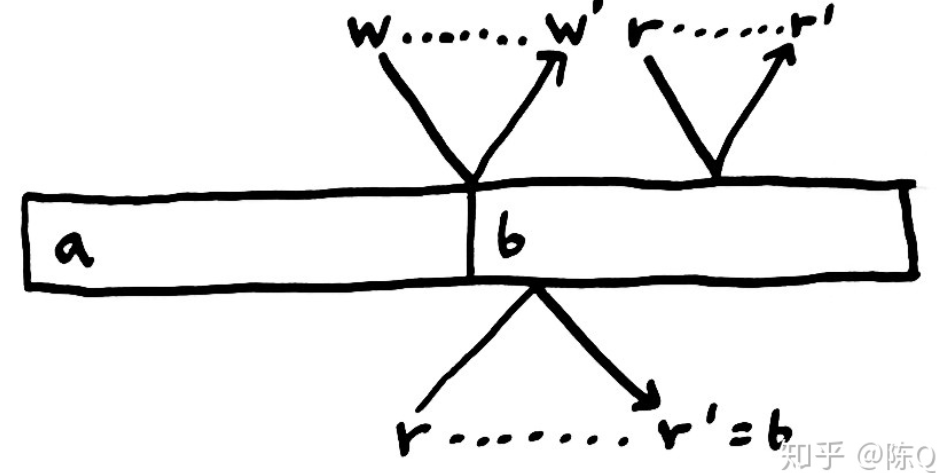
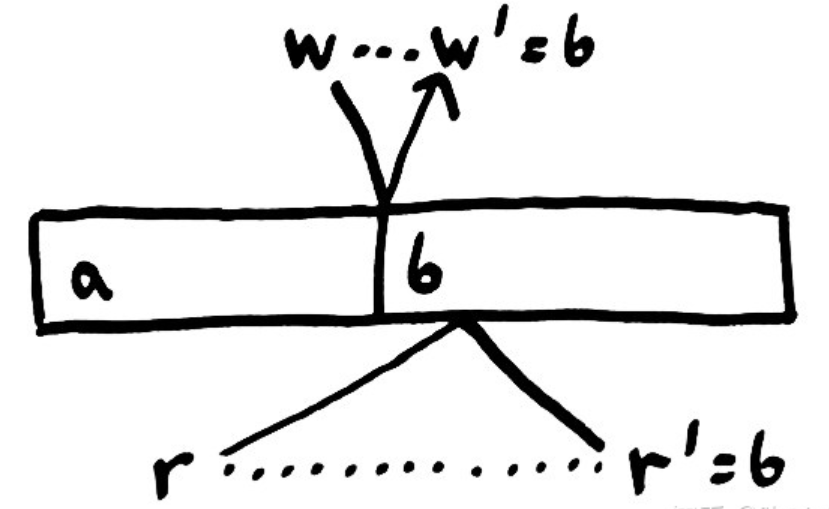

# 一致性模型 - Consistency Model

> 交换机，网络接口控制器，主机硬件，操作系统，硬盘，虚拟机，语言运行时，更不用说程序语义本身，所有的这些将导致我们的消息可能会延迟，被丢弃，重复或被重新排序。在一个充满不确定的世界里，我们希望程序保持一种**直观的正确性**。

* 这引出了对系统正确性的定义：给定一些涉及操作与状态的**规则**，随着操作的演进，系统将一直遵循这些规则来达成某种程度上的操作一致性，我们把这样的规则称为**一致性模型**。

# 光锥 - Light Cones

> 这是一种类比：**读写不再是一个瞬时的过程，而是一个类似光传播 -> 反射面 -> 反向传播的过程。**

现实往往没有那么理想化：在几乎每个实际的系统中，进程之间都有一定的**物理距离**。

> 常在距离CPU30厘米的DIMM内存条上。光需要整整一个纳秒来传播这么长的距离。而实际的内存访问会比光速慢得多。

这意味着我们的操作不再是瞬时的。通常来说，操作是**耗时**的。

* 我们调用对一个变量的写操作；写操作传播到内存，或其他计算机，或月球；内存改变状态；一个确认信息回传；这样我们才知道这个操作真实的发生了。

* 不同地点之间传送消息的延迟会在操作记录中造成**歧义**。消息传播的快慢会导致预期外的事件顺序发生。
* 在分布式系统中，操作的耗时被放大了，我们必须使一致性模型**更宽松**：允许这些有歧义的顺序发生。
* 我们该如何确定宽松的程度？我们必须允许所有可能的顺序吗？或许我们还是应该强加一些合理性约束？

# Reference

* https://aphyr.com/posts/288-the-network-is-reliable
* [译] 分布式系统中的一致性模型 - 陈Qiu凯的文章 - 知乎 https://zhuanlan.zhihu.com/p/48782892
* https://aphyr.com/posts/313-strong-consistency-models
