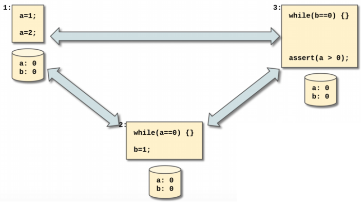
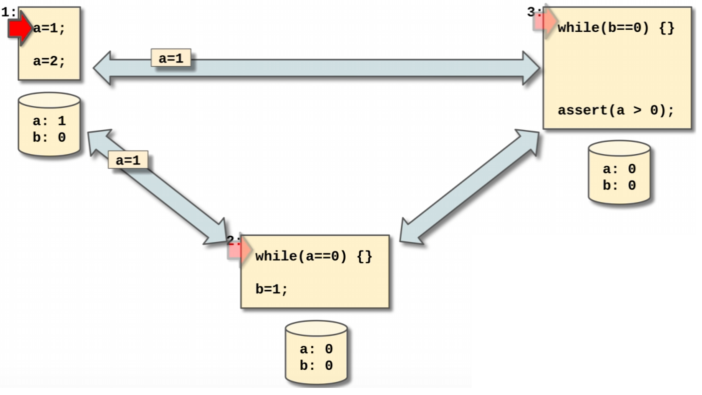
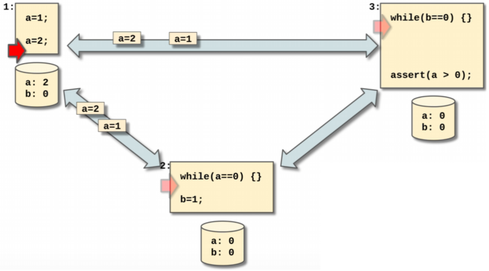
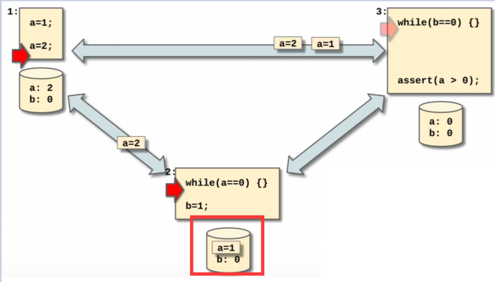
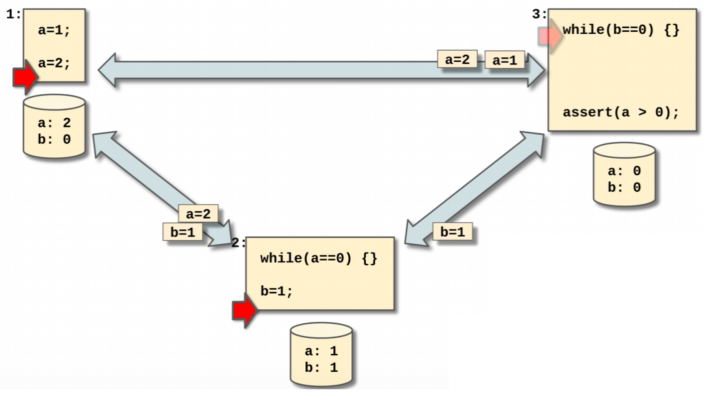
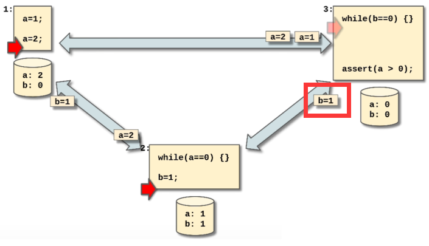
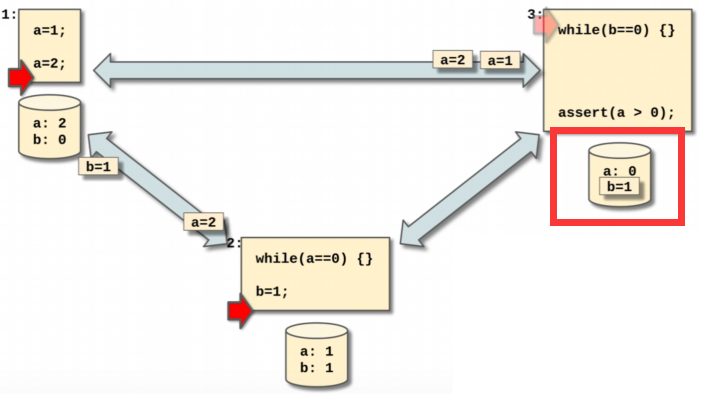
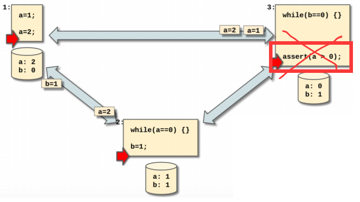

# FIFO Consistency - 先进先出一致性

> a.k.a Pipelined RAM Consistency (PRAM Consistency).

* Writes done by a single process are seen by all other processes in the order in which they were issued, but writes from different processes may be seen in a different order by different processes.
    * 大白话：单个进程（process）发出的写操作（write），将按照发出的顺序被所有其他进程所观察到，但是来自不同进程的写操作在不同进程之间的观察顺序可能不同。

## 案例 - Example

对于一个具有FIFO Consistency的系统来说，考虑以下三个进程，我们还是假设每个进程拥有自己的“copy of data”。但是相比于sequential consistency的广播式（boradcasting）地进程之间的沟通，FIFO consistency选择的是类似于pipeline式地沟通：

 假设三个进程都在并行运行，同时进程1修改了一次变量$a = 1$，那么进程1就会通过pipeline通知每一个其他的进程：

然后紧接着进程1又一次修改了变量$b = 2$：

* 注意看，这里就对应了我们的definition里的这一句：“<u>Writes done by a single process are seen by all other processes in the order in which they were issued.</u>”

紧接着当进程2先接收到了进程1的写操作（write）的时候，也就是先感知到了$a = 1$的变化，那么进程2会很快完成对变量$b = 1$的操作，并将该事件发送给进程3：

|  |  |
| ------------------------------------------------------------ | ------------------------------------------------------------ |

结果对于进程3而言，$b = 1$的操作比$a = 1$的操作优先到达：

|  |  |
| ------------------------------------------------------------ | ------------------------------------------------------------ |

结果在进程3的视角里，由于$b=1$的操作先接收到，导致while loop提前结束，紧接着assertion报错，因为在进程3的视角里还没有接收到$a=1$的变化，哪怕我们作为上帝观察者而言$a=1$先于$b = 1$的：

## 为什么要使用FIFO Consistency？

* no central write queue bottleneck.
* Needs more careful programming.
* PRAM relaxes the need to maintain coherence to a location across all its processors. Here, reads to any variable can be executed before writes in a processor. Read before write, read after read and write before write ordering is still preserved in this model.

# Reference

* https://en.wikipedia.org/wiki/Consistency_model
* https://www.youtube.com/watch?v=Fm8iUFM2iWU&list=RDLVFm8iUFM2iWU&start_radio=1&rv=Fm8iUFM2iWU&t=0
* https://www.cs.colostate.edu/~cs551/CourseNotes/Consistency/TypesConsistency.html

