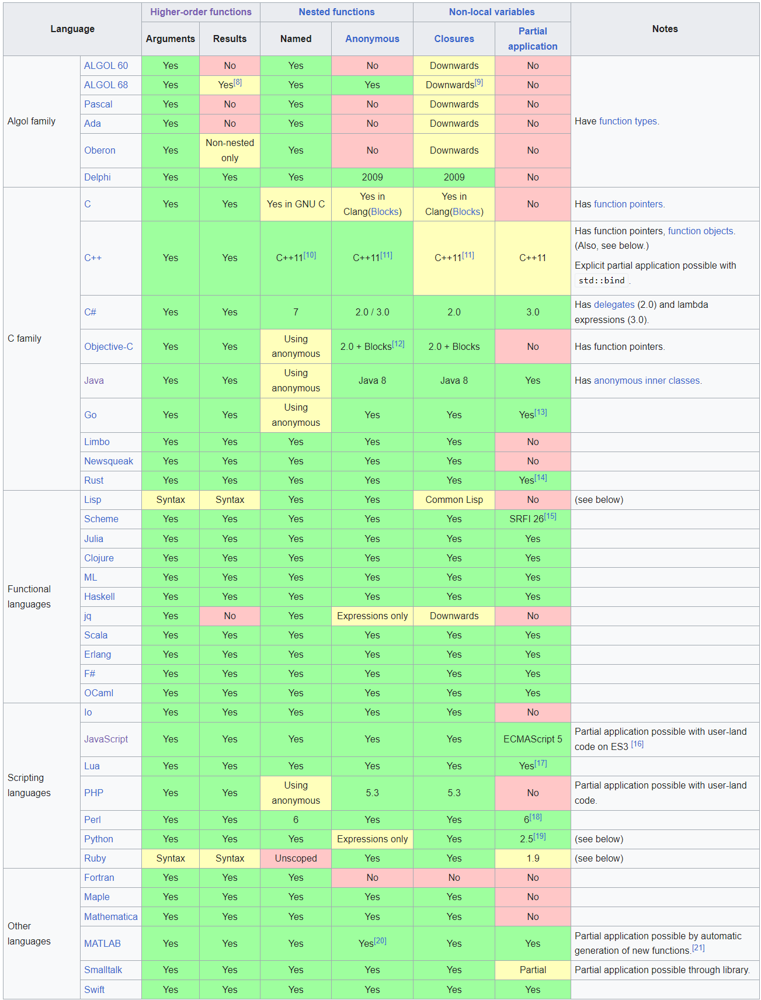

# 高阶函数 - Higher-order Function

In mathematics and computer science, a <u>higher-order function (HOF)</u> is a function that does at least one of the following:

1. take functions as arguments;
2. returns a function as its result;

## 使用场景

* `map`
* `sort`
* `filter`
* `fold`
* `apply`
* `tree traversal`

## 语言支持 - Language Support

# Reference

* https://en.wikipedia.org/wiki/Higher-order_function
