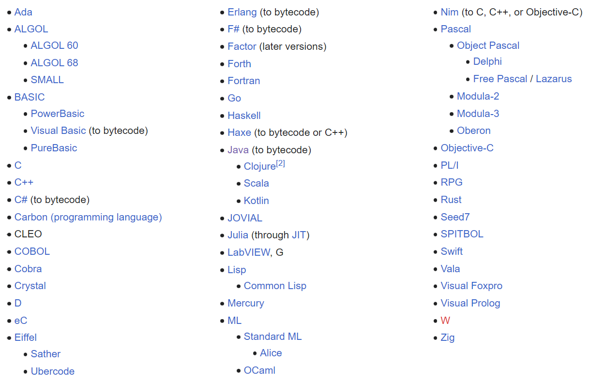

# 编译器 - Compiler

> In computing, a compiler is a computer program that translates computer code written in one programming language (the source language) into another language (the target language). 
>
> The name "compiler" is primarily used for programs that translate source code from a high-level programming language to a low-level programming language (e.g. assembly language, object code, or machine code) to create an executable program.

> A compiled language is a programming language whose implementations are typically compilers (translators that generate machine code from source code), and not interpreters (step-by-step executors of source code, where no pre-runtime translation takes place).

## Compiled Language

Some languages that are commonly considered to be compiled:

 

# Reference

* https://en.wikipedia.org/wiki/Compiler