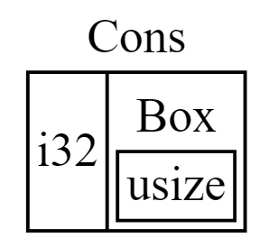

# `Box<T>` Type

The most straightforward smart pointer is a **box**, whose type is written `Box<T>`. Boxes allow you to store data on the heap rather than the stack. What remains on the stack is the pointer to the heap data. Refer to Chapter 4 to review the difference between the stack and the heap.

> Boxes don’t have performance overhead, other than storing their data on the heap instead of on the stack. But they don’t have many extra capabilities either. 

You’ll use them most often in these situations:

- When you have a type whose size can’t be known at compile time and you want to use a value of that type in a context that requires an exact size.
- When you have a large amount of data and you want to transfer ownership but ensure the data won’t be copied when you do so.
- When you want to own a value and you care only that it’s a type that implements a particular trait rather than being of a specific type.

# Using a `Box` to Store Data on the Heap

```RUST
fn main() {
    let b = Box::new(5);
    println!("b = {}", b);
}
```

* Just like any owned value, when a box goes out of scope, as `b` does at the end of `main`, it will be deallocated. The deallocation happens both for the box (stored on the stack) and the data it points to (stored on the heap).

> Putting a single value on the heap isn’t very useful, so you won’t use boxes by themselves in this way very often. Having values like a single `i32` on the stack, where they’re stored by default, is more appropriate in the majority of situations.

# Enabling Recursive Types with Boxes

A value of *recursive type* can have another value of the same type as part of itself. Recursive types pose an issue because at compile time Rust needs to know how much space a type takes up. However, the nesting of values of recursive types could theoretically continue infinitely, so Rust can’t know how much space the value needs. Because boxes have a known size, we can enable recursive types by inserting a `box `in the recursive type definition.

> A *cons list* is a data structure that comes from the Lisp programming language and its dialects and is made up of nested pairs, and is the Lisp version of a linked list. Its name comes from the `cons` function (short for “construct function”) in Lisp that constructs a new pair from its two arguments. By calling `cons` on a pair consisting of a value and another pair, we can construct cons lists made up of recursive pairs.

Here is an example that tries to express a `con` using enums in Rust that has an infinite size:

```rust
enum List {
    Cons(i32, List), // ❌ WON'T COMPILE
    Nil,
}
```

* The error shows this type “has infinite size.” The reason is that we’ve defined `List` with a variant that is recursive: it holds another value of itself directly. As a result, Rust can’t figure out how much space it needs to store a `List` value.

We can fix it by using `Box<T>` to get a recursive type with a known size:

```rust
enum List {
    Cons(i32, Box<List>),
    Nil,
}
```

* The `Cons` variant needs the size of an `i32` plus the space to store the box’s pointer data. The `Nil` variant stores no values, so it needs less space than the `Cons` variant. We now know that any `List` value will take up the size of an `i32` plus the size of a box’s pointer data. By using a box, we’ve broken the infinite, recursive chain, so the compiler can figure out the size it needs to store a `List` value:
* 

# Summary

Boxes provide only the indirection and heap allocation; they don’t have any other special capabilities, like those we’ll see with the other smart pointer types. They also don’t have the performance overhead that these special capabilities incur, so they can be useful in cases like the cons list where the indirection is the only feature we need.

The `Box<T>` type is a smart pointer because it implements the `Deref` trait, which allows `Box<T>` values to be treated like references. When a `Box<T>` value goes out of scope, the heap data that the box is pointing to is cleaned up as well because of the `Drop` trait implementation. These two traits will be even more important to the functionality provided by the other smart pointer types we’ll discuss in the rest of this chapter. Let’s explore these two traits in more detail.
