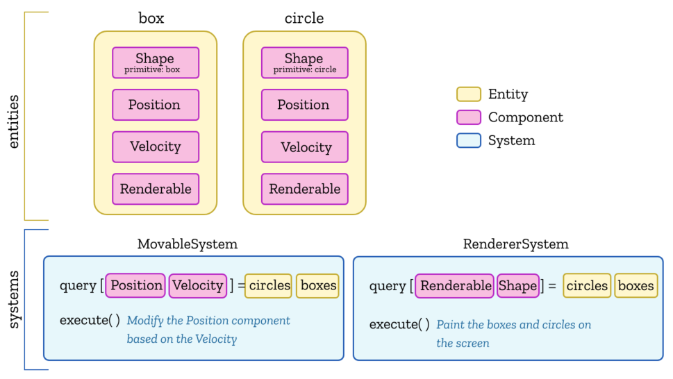
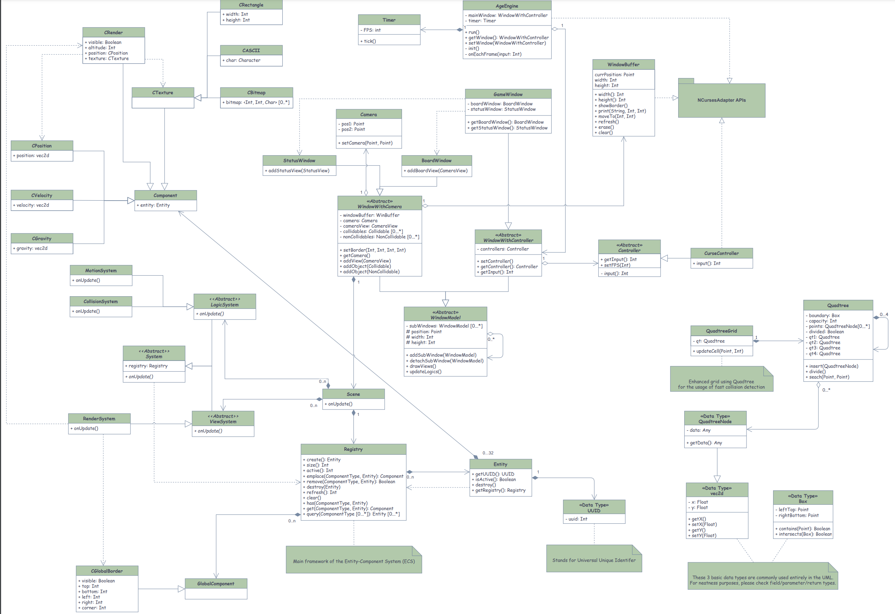

# ECS - Entity Component System

An ECS comprises <u>entities</u> composed from <u>components</u>, with <u>systems</u> which operate on entities' components.

* **Entity**: An entity represents a general-purpose object.
    * In a game engine context, for example, every game character is represented as an entity. Usually, it only consists of a unique id.
* **Component**: A component labels an <u>entity</u> as possessing a particular feature, and holds the data needed to represent that feature.
    * In a game engine context, for example, to represent an entity possesses a health feature, we can define a component to like `HealthComponent` for each entity that logically should possess the feature.
* **System**: A system is a process which acts on all entities with the desired components.
    * For example, a physics system may query for entities having mass, velocity and position components, and iterate over the results doing physics calculations on the sets of components for each entity.

> ECS模式常见于video gaming开发。该模式选择了<u>composition</u>而不是<u>inheritance</u>，代表着对于每个定义的entity而言，并不是通过type hierarchy实现，而是通过将不同的components组合（composite）在一起。而system的作用就是与所有具有某些特定的component特性的entity产生互动。

这里贴一张我大二设计的一个简单的基于ECS的2D ASCII-based游戏引擎：

## 历史 - History

ECS这玩意发明的时候比较近代了，大约发生在2007年那个时间段左右。

# Reference

* https://en.wikipedia.org/wiki/Entity_component_system