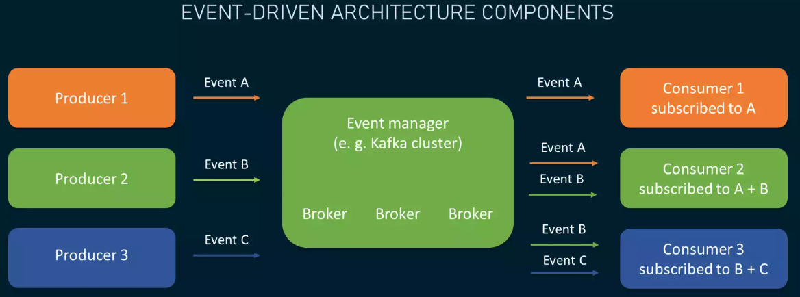

# 事件驱动架构 - Event Driven Architecture (EDA)

> EDA是一个概念，并不是一个具体的实现方式。譬如我们可以用回调函数（callback）来实现EDA，但是我们也可以用其他方式来实现，比如一个message queue（MQ）等等。

* 事件（Event）—— 它并不是一种命令，可以是一种状态的变化，可以是一些元数据。

## 构成 - Components

EDA通常会存在三个角色：

* <u>event producers</u>: 产生事件的角色，并将事件传输给managers。
* <u>event managers</u>: 一种中间层、过滤层的角色，负责将接收到的事件以正确或者合适的方式发送给consumers。
* <u>event consumers</u>: 消费事件的角色，由于事件本身就是元数据，consumers可以根据事件自行决定该如何反应。

## EDA的特点

* 低耦合（Loose Coupling）- Producers and consumers are unaware of each other（因为有一个中间层）。

    > 不过也是因为低耦合，其中一个小毛病就是只通过代码层面来看，是看不出来系统的整体架构的，因为低耦合的特性导致你不好看出来其中的dependency relationships。

* 可拓展性（Extensibility）- 因为零耦合，因此在中间层的两侧，我们可以方便地添加、删减producers或者consumers来达成新业务的同时而不影响其他组件。

* 异步事件（Asynchronous）- EDA可以非常naturally地实现异步。

# Reference

* https://www.altexsoft.com/blog/event-driven-architecture-pub-sub/
* https://en.wikipedia.org/wiki/Event-driven_architecture
* https://zhuanlan.zhihu.com/p/51357583