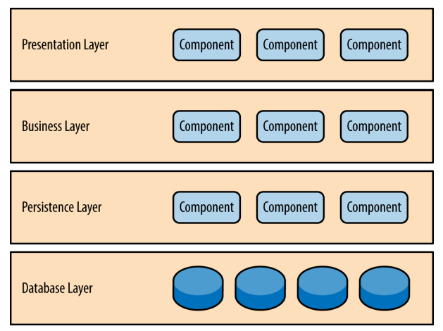
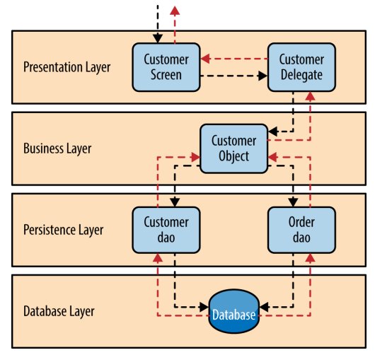

# 分层架构 - Layered Architecture

> 最常见的软件架构，也是事实上的标准架构。如果不知道要用什么架构，可以考虑这种架构。
>
> > 同时也被叫做N-tier Architecture。

## 描述 - Description

Components within the layered architecture pattern are organized into horizontal layers, each layer performing a specific role within the application (e.g., presentation logic or business logic). Although the layered architecture pattern does not specify the number and types of layers that must exist in the pattern, most layered architec‐ tures consist of four standard layers: 

* 显示层（presentation）：用户界面

* 业务层（business）：实现业务逻辑

* 持久层（persistence）：提供数据

* 数据库（database）：保存数据

    > 有些时候business layer和persistence layer被合并成了一个business layer，也就是总架构分为三层。比方说SQL本身作为presistence layer就被嵌套进了business layer。

用户的请求将依次通过这四层的处理，不能跳过其中任何一层。

## 优点

* 结构简单，容易理解和开发。不同技能的程序员可以分工，负责不同的层，天然适合大多数软件公司的组织架构。
* 层与层之间不需要知道implementaion。
* 每一层都适合独立测试。

## 缺点

* 用户的请求将依次通过这四层的处理，不能跳过其中任何一层。一旦其中一层出现错误，那么整个系统都将有可能出现问题。
* 一旦环境（environment）变化，需要代码调整或增加功能时，通常比较麻烦和费时。
* 根据具体的架构实现，每一层的部署效率可能会受到影响。

## 案例

# Reference

* https://zhuanlan.zhihu.com/p/94665982
* https://overcoded.dev/posts/Arch-14
* Software Architecture Patterns by Mark Richards