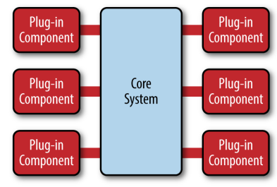

# 微内核架构 - Microkernel Architecture

* 微内核架构（microkernel architecture）有时又称为"插件架构"（plug-in architecture），指的是软件的内核相对较小，主要功能和业务逻辑都通过插件（plug-in）实现。

* 对于product-based application来说，微内核架构是一种很自然地选择：

    > product-based application：the one that is packaged and made available for download in versions as a typical third-party product.

## 内核 - Core

内核（core）通常只包含系统运行的最小功能。

## 插件模块 - Plugin Modules

插件则是互相独立的，插件之间的通信，应该减少到最低，避免出现互相依赖的问题。

* The core system needs to know about which plug-in modules are available and how to get to them. One common way of implement‐ ing this is through some sort of plug-in registry. This registry con‐ tains information about each plug-in module, including things like its name, data contract, and remote access protocol details (depend‐ ing on how the plug-in is connected to the core system).
* Plug-in modules can be connected to the core system through a variety of ways, including OSGi (open service gateway initiative), messaging, web services, or even direct point-to-point binding (i.e., object instantiation).

## 插件与内核的交互

The contracts between the plug-in modules and the core system can range anywhere from standard contracts to custom ones.

> Custom contracts are typically found in situations where plug-in compo‐ nents are developed by a third party where you have no control over the contract used by the plug-in.

* In such cases, it is common to cre‐ ate an adapter between the plug-in contact and your standard con‐ tract so that the core system doesn’t need specialized code for each plug-in. When creating standard contracts (usually implemented through XML or a Java Map), it is important to remember to create a versioning strategy right from the start.

## 优点

- 良好的功能延伸性（extensibility），需要什么功能，开发一个插件即可。
- 功能之间是隔离的，插件可以独立的加载和卸载，使得它比较容易部署。
- 可定制性高，适应不同的开发需要。
- 可以渐进式地开发，逐步增加功能。

## 缺点

- 扩展性（scalability）差，内核通常是一个独立单元，不容易做成分布式。
- 开发难度相对较高，因为涉及到插件与内核的通信，以及内部的插件登记机制。

# Reference

* Software Architecture Patterns by Mark Richards