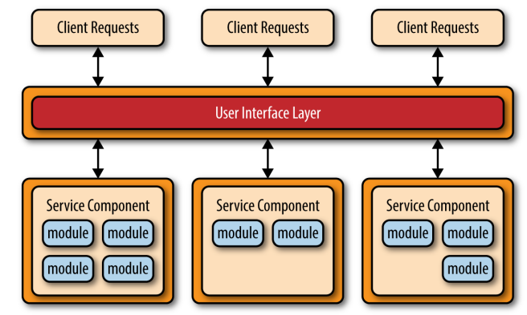

# 微服务架构 - Microservice Architecture

> 微服务架构（microservices architecture）是服务导向架构（service-oriented architecture，缩写 SOA）的升级。

* 微服务（microservice）—— 每一个服务就是一个独立的部署单元（separately deployed unit），每一个服务的目的是提供一定的功能，其内部实现可能是多个模块（module）的结合。

## 优点

- 扩展性好，各个服务之间低耦合。
- 容易部署，软件从单一可部署单元，被拆成了多个服务，每个服务都是可部署单元。
- 容易开发，每个组件都可以进行持续集成式的开发，可以做到实时部署，不间断地升级。
- 易于测试，可以单独测试每一个服务。

## 缺点

- 由于强调互相独立和低耦合，服务可能会拆分得很细。这导致系统依赖大量的微服务，变得很凌乱和笨重，性能也会不佳。
- 一旦服务之间需要通信（即一个服务要用到另一个服务），整个架构就会变得复杂。典型的例子就是一些通用的 Utility 类，一种解决方案是把它们拷贝到每一个服务中去，用冗余换取架构的简单性。
- 分布式的本质使得这种架构很难实现原子性操作，交易回滚会比较困难。

# Reference

* Software Architecture Patterns by Mark Richards
* https://zhuanlan.zhihu.com/p/94665982