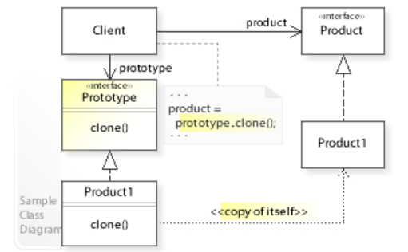
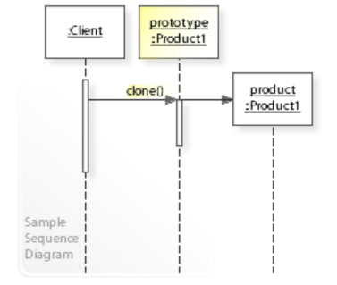

# 原型模式 - Prototype Pattern

> Prototype pattern是一种创建型设计模式，它提供了一种创建对象的方法，通过复制现有的对象来创建新的对象，而不是通过使用构造函数来创建。

* 在Prototype pattern中，客户端通过原型对象创建新的对象，而不是通过构造函数。当客户端需要创建新对象时，它向原型对象发送克隆自己的请求，并传递所需的参数。原型对象使用该参数创建一个新的对象，并将其返回给客户端。客户端可以使用该新对象进行操作，而不会影响原型对象。
    * Prototype pattern的优点是可以避免创建大量相似的对象，从而提高系统的性能和效率。它也可以提高系统的灵活性和可扩展性，因为可以在运行时动态地添加或删除原型对象。
    * 此外，Prototype pattern还可以简化对象创建的过程，使代码更加简洁和易于维护。
    * The client, instead of writing code that invokes the `new` operator on a hard-coded class name, calls the *clone()* method on the prototype.

## Class Diagram

## Sequence Diagram

# Reference

* https://en.wikipedia.org/wiki/Prototype_pattern