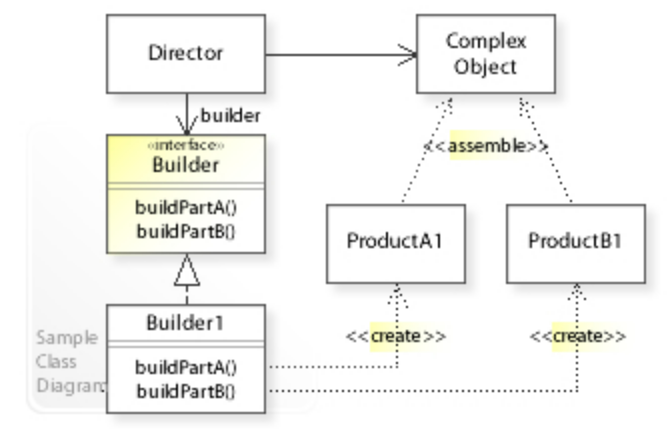
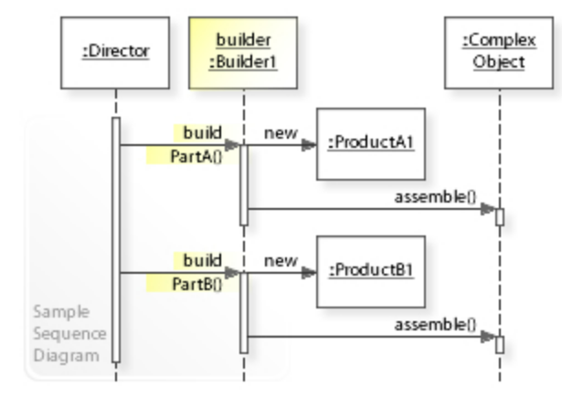

# 建造者模式 - Builder Pattern

The intent of the Builder design pattern is to separate the construction of a complex object from its representation. By doing so, the same construction process can create different representations.

>   一个Builder类会一步一步构造最终的对象。该Builder类是独立于其他对象的。

## Class Diagram



## Sequence Diagram



## 优势

*   Allows you to vary a product's internal representation.
*   Encapsulates code for construction and representation.
*   Provides control over steps of construction process.

## 劣势

*   A distinct ConcreteBuilder must be created for each type of product.
*   Builder classes must be mutable.
*   May hamper/complicate dependency injection.


## 跟工厂方法模式对比

>   建造者模式和工厂模式同样是创建一个产品，工厂模式就是一个方法，而建造者模式有多个方法，并且建造者模式是有**顺序**的执行方法。就是说建造者模式<u>强调的是顺序</u>，而工厂模式没有顺序一说。


## 代码案例 - Code Example (C#)

```c#
/// Represents a product created by the builder
public class Bicycle
{
    public string Make { get; set; }
    public string Model { get; set; }
    public int Height { get; set; }
    public string Colour { get; set; }

    public Bicycle(string make, string model, string colour, int height)
    {
        Make = make;
        Model = model;
        Colour = colour;
        Height = height;
    }
}

/// The builder abstraction
public interface IBicycleBuilder
{
    string Colour { get; set; }
    int Height { get; set; }

    Bicycle GetResult();
}

/// Concrete builder implementation
public class GTBuilder : IBicycleBuilder
{
    public string Colour { get; set; }
    public int Height { get; set; }

    public Bicycle GetResult()
    {
        return Height == 29 ? new Bicycle("GT", "Avalanche", Colour, Height) : null;        
    }
}

/// The director
public class MountainBikeBuildDirector
{
    private IBicycleBuilder _builder;
    public MountainBikeBuildDirector(IBicycleBuilder builder) 
    {
        _builder = builder;
    }

    public void Construct(string colour, int height)
    {
        _builder.Colour = colour;
        _builder.Height = height;
    }

    public Bicycle GetResult()
	{
		return this._builder.GetResult();
	}
}

public class Client
{
    public void DoSomethingWithBicycles()
    {
        var director = new MountainBikeBuildDirector(new GTBuilder());
        Bicycle myMountainBike = director.Construct("Red", 28).GetResult();
        Bicycle myMountainBike2 = director.Construct("Blue", 31).GetResult();
    }
}
```


# Reference

*   https://en.wikipedia.org/wiki/Builder_pattern