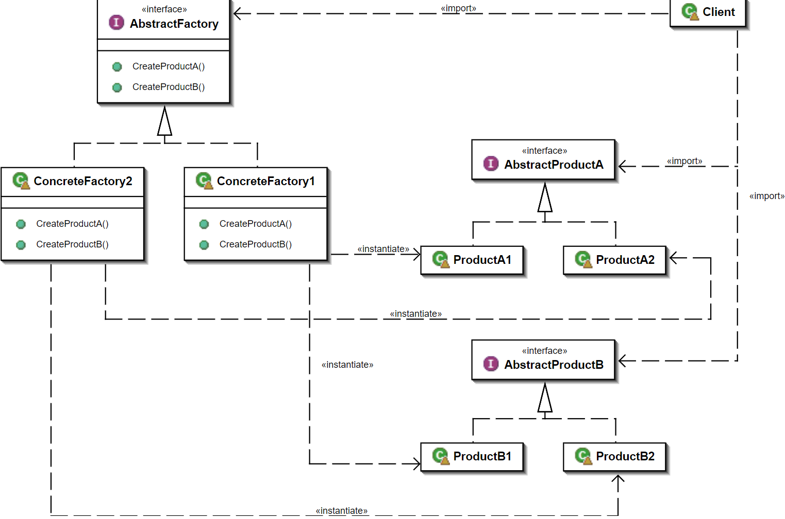
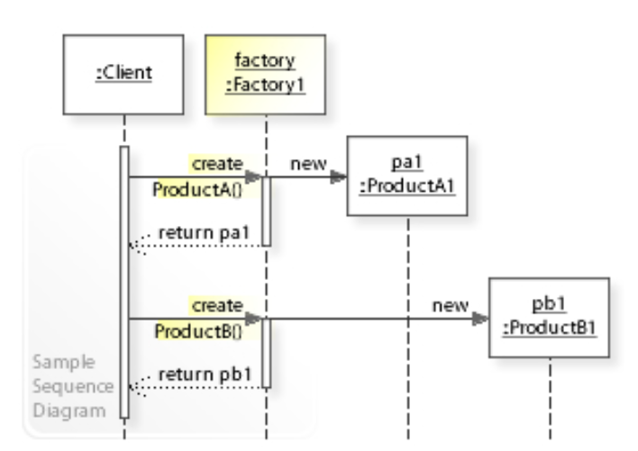

# 抽象工厂模式 - Abstract Factory Pattern

> “An interface for creating families of related or dependent objects without specifying their concrete classes.” —— 《Design Patterns: Elements of Reusable Object-Oriented Software》

> Abstract Factory模式与Factory Method模式最大的区别：Abstract Factory中每个工厂可以创建多种类的产品；而Factory Method每个工厂只能创建一类。
>
> > chatGPT: 抽象工厂模式与工厂方法模式的区别在于，抽象工厂模式针对的是产品族的创建，而工厂方法模式针对的是单一产品的创建。抽象工厂模式提供了一组用于创建一整个产品族的方法，每个方法对应一个产品，这些产品之间可能存在某些约束关系。客户端通过抽象工厂的接口来创建一组相关的产品，客户端代码只需要知道抽象工厂的接口即可。

抽象工厂模式通常包括以下几个角色：

1. 抽象工厂（Abstract Factory）：定义了一组用于创建产品族的方法，每个方法对应一种产品。客户端通过调用这些方法来创建产品。
2. 具体工厂（Concrete Factory）：实现抽象工厂中定义的方法，每个具体工厂对应一个具体的产品族。
3. 抽象产品（Abstract Product）：定义了产品的接口，客户端通过该接口访问产品。
4. 具体产品（Concrete Product）：实现抽象产品中定义的接口，是抽象工厂模式创建的目标对象。

## Class Diagram



## Sequence Diagram




## 代码案例 - Code Example

```c#
using System;

namespace ConsoleApp2
{
    class Class4
    {
        public static void Main(String[] args)
        {
            //生产宝马320系列配件
            FactoryBMW320 factoryBMW320 = new FactoryBMW320();
            factoryBMW320.CreateEngine();
            factoryBMW320.CreateTyre();

            //生产宝马523系列配件  
            FactoryBMW523 factoryBMW523 = new FactoryBMW523();
            factoryBMW320.CreateEngine();
            factoryBMW320.CreateTyre();

            Console.ReadLine();
        }
    }

    // 发动机以及型号  
    public interface Engine
    {

    }
    public class EngineA : Engine
    {
        public EngineA()
        {
            Console.WriteLine("制造-->EngineA");
        }
    }
    public class EngineB : Engine
    {
        public EngineB()
        {
            Console.WriteLine("制造-->EngineB");
        }
    }

    // 轮胎以及型号  
    public interface Tyre
    {

    }
    public class TyreA : Tyre
    {
        public TyreA()
        {
            Console.WriteLine("制造-->TyreA");
        }
    }
    public class TyreB : Tyre
    {
        public TyreB()
        {
            Console.WriteLine("制造-->TyreB");
        }
    }

    // 创建工厂的接口  
    public interface AbstractFactory
    {
        //制造发动机
        Engine CreateEngine();
        //制造轮胎 
        Tyre CreateTyre();
    }


    // 为宝马320系列生产配件
    public class FactoryBMW320 : AbstractFactory
    {
        public Engine CreateEngine()
        {
            return new EngineA();
        }
        public Tyre CreateTyre()
        {
            return new TyreA();
        }
    }
    // 宝马523系列生产配件
    public class FactoryBMW523 : AbstractFactory
    {
        public Engine CreateEngine()
        {
            return new EngineB();
        }
        public Tyre CreateTyre()
        {
            return new TyreB();
        }
    }
}
```

# Reference

* https://en.wikipedia.org/wiki/Abstract_factory_pattern
* https://cloud.tencent.com/developer/article/1394271