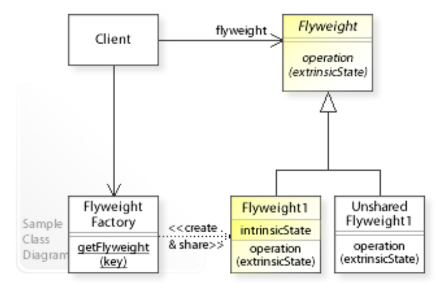
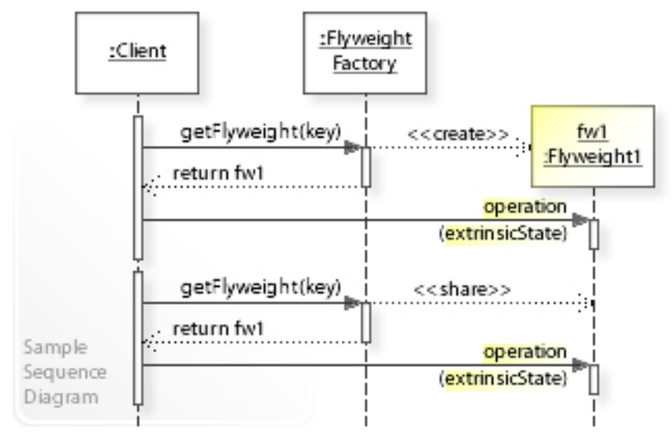

# 享元模式 - Flyweight Pattern

>   Flyweight模式（也称为轻量级模式）是一种软件设计模式，它的目的是最小化内存使用和提高性能。Flyweight模式的核心思想是共享对象，即将需要重复创建的对象共享在内存中，而不是每次都重新创建新对象，以此来节约内存和提高性能。

在Flyweight模式中，通常将对象分为两部分：

1.   内部状态（Intrinsic State）: 内部状态是可以被共享的，
2.   外部状态（Extrinsic State）: 而外部状态则是每个对象所独有的，不能被共享。

>   通过将对象的内部状态共享在内存中，可以大大减少对象所占用的内存空间。

## Class Diagram

## Sequence Diagram

## Usage

*   A classic example are the data structures used <u>representing characters</u> in a word processor. Naively, each character in a document might have a glyph object containing its font outline, font metrics, and other formatting data. However, this would use hundreds or thousands of bytes of memory for each character. Instead, each character can have a reference to a glyph object shared by every instance of the same character in the document. This way, only the position of each character needs to be stored internally.

# Reference

*   https://en.wikipedia.org/wiki/Flyweight_pattern