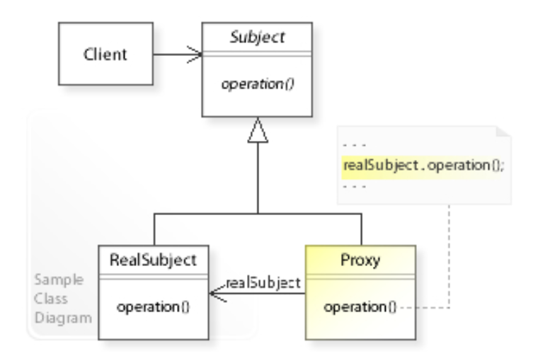
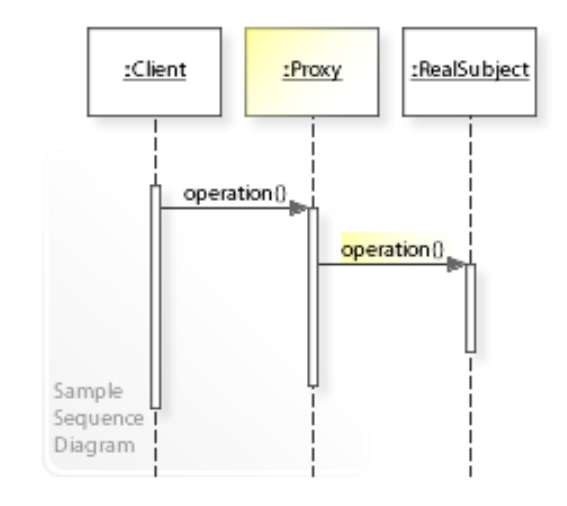

# 代理模式 - Proxy Pattern

> In short, a proxy is a wrapper or agent object that is being called by the client to access the real serving object behind the scenes.
> 它提供了一个代理对象，充当了另一个对象的接口，以控制对原始对象的访问。
>
> 因为代理对象和原始对象具有相同的接口，因此代理对象可以代替原始对象使用。
>
> 代理模式通常用于以下情况：
>
> 1. 远程代理：代理对象在不同的地址空间中，用于访问远程对象。
> 2. 虚拟代理：代理对象用于访问资源消耗较大的对象，只有在需要时才创建真实对象。
>     * example: Lazy loading
> 3. 保护代理：代理对象用于控制对原始对象的访问，可以对访问进行限制或者提供额外的安全措施。
> 4. 智能引用代理：代理对象可以在访问原始对象时执行额外的操作，例如计算引用次数、缓存结果等。

## Class Diagram



## Sequence Diagram




## JavaScript案例 - JavaScript Example

```js
// Driver class
class Driver {
  constructor (age) {
    this.age = age
  }
}

// Car class
class Car {
  drive () {
    console.log('Car has been driven!')
  }
}

// Proxy car class
class ProxyCar {
  constructor (driver) {
    this.car = new Car()
    this.driver = driver
  }

  drive () {
    if (this.driver.age <= 16) {
      console.log('Sorry, the driver is too young to drive.')
    } else {
      this.car.drive()
    }
  }
}

// Run program
const driver = new Driver(16)
const car = new ProxyCar(driver)
car.drive()

const driver2 = new Driver(25)
const car2 = new ProxyCar(driver2)
car2.drive()
```


```
Sorry, the driver is too young to drive.
Car has been driven!
```

# Reference

* https://en.wikipedia.org/wiki/Proxy_pattern