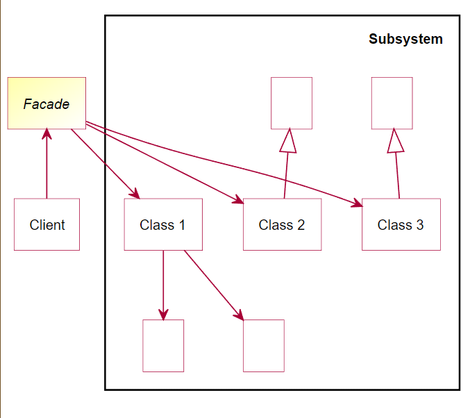
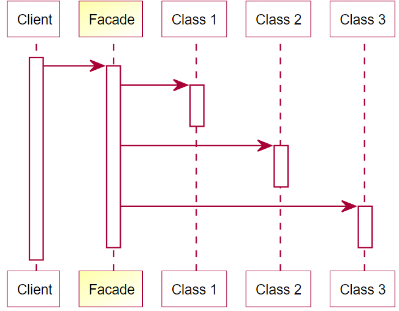

# 外观模式 - Facade pattern

> 非常好理解的一个pattern：它提供了一个统一且简单的接口，隐藏了内部的复杂系统的实现细节，使得client可以更容易地使用该系统。
>
> > 把一个复杂的系统打包成一个接口，client只跟这个接口互动，就这样。

Facade模式通常由以下组件组成：

1. 外观（Facade）：提供了一个简单的接口，隐藏了子系统的复杂性，并将子系统组织在一起，客户端通过该接口访问系统。
2. 子系统（Subsystems）：包括多个组件，每个组件都是独立的，但它们一起实现了系统的功能。子系统中的组件可以直接相互通信，但它们不直接与客户端通信。

## Class Diagram

## Sequence Diagram

# Reference

* https://en.wikipedia.org/wiki/Facade_pattern