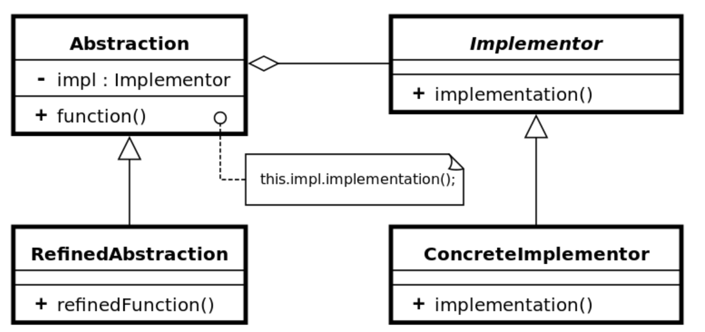

# 桥接模式 - Bridge Pattern

> 在Bridge Pattern中，Abstraction和Implementor是相互独立的，它们各自可以进行变化和演化。Abstraction通过持有一个Implementor的指针来委托其实现，从而将实现的细节隐藏起来，达到解耦的效果。

在Bridge Pattern中，由以下几个角色组成：

1. Abstraction（抽象类）：定义抽象类的接口，它维护一个指向Implementor的指针。
2. RefinedAbstraction（扩充抽象类）：扩展Abstraction接口，通常实现一些具体的行为。
3. Implementor（实现类接口）：定义实现类的接口。
4. ConcreteImplementor（具体实现类）：实现Implementor接口的具体实现类。

## Class Diagram



## Sequence Diagram


## 代码案例 - Code Example

```c#
// Helps in providing truly decoupled architecture
public interface IBridge
{
    void Function1();
    void Function2();
}

public class Bridge1 : IBridge
{
    public void Function1()
    {
        Console.WriteLine("Bridge1.Function1");
    }

    public void Function2()
    {
        Console.WriteLine("Bridge1.Function2");
    }
}

public class Bridge2 : IBridge
{
    public void Function1()
    {
        Console.WriteLine("Bridge2.Function1");
    }

    public void Function2()
    {
        Console.WriteLine("Bridge2.Function2");
    }
}

public interface IAbstractBridge
{
    void CallMethod1();
    void CallMethod2();
}

public class AbstractBridge : IAbstractBridge
{
    public IBridge bridge;

    public AbstractBridge(IBridge bridge)
    {
        this.bridge = bridge;
    }

    public void CallMethod1()
    {
        this.bridge.Function1();
    }

    public void CallMethod2()
    {
        this.bridge.Function2();
    }
}
```


# Reference

* https://en.wikipedia.org/wiki/Bridge_pattern