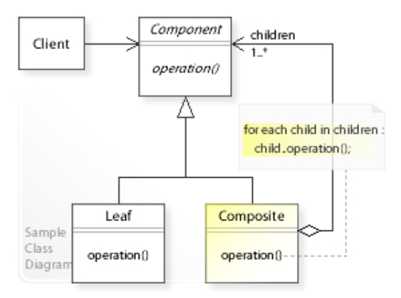
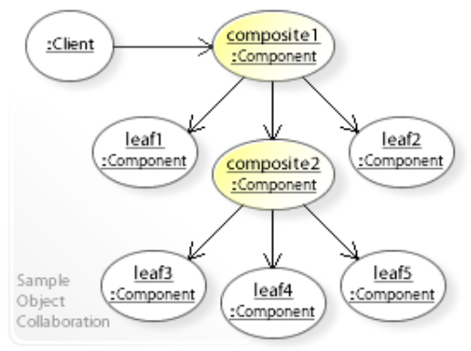
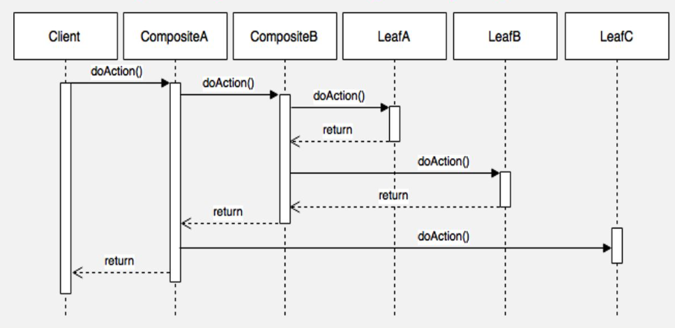

# 组合模式 - Composite Pattern

> composes zero-or-more similar objects so that they can be manipulated as one object.

The composite pattern describes a group of objects that are treated the same way <u>as a single instance</u> of the same type of object.

## Class Diagram



## Object Diagram



## Sequence Diagram



## What problems can the Composite design pattern solve?

- A part-whole hierarchy should be represented so that clients can treat part and whole objects uniformly.
- A part-whole hierarchy should be represented as tree structure.

## When To Use

> Composite should be used when <u>clients ignore the difference between compositions of objects and individual objects</u>. If programmers find that they are using multiple objects in the same way, and often have nearly identical code to handle each of them, then composite is a good choice; it is less complex in this situation to treat primitives and composites as homogeneous.

# 代码案例 - Code Example

```java
import java.util.List;
import java.util.ArrayList;

/** "Component" */
interface Graphic {
    //Prints the graphic.
    public void print();
}

/** "Composite" */
class CompositeGraphic implements Graphic {
    //Collection of child graphics.
    private final List<Graphic> childGraphics = new ArrayList<>();

    //Adds the graphic to the composition.
    public void add(Graphic graphic) {
        childGraphics.add(graphic);
    }
    
    //Prints the graphic.
    @Override
    public void print() {
        for (Graphic graphic : childGraphics) {
            graphic.print();  //Delegation
        }
    }
}

/** "Leaf" */
class Ellipse implements Graphic {
    //Prints the graphic.
    @Override
    public void print() {
        System.out.println("Ellipse");
    }
}

/** Client */
class CompositeDemo {
    public static void main(String[] args) {
        //Initialize four ellipses
        Ellipse ellipse1 = new Ellipse();
        Ellipse ellipse2 = new Ellipse();
        Ellipse ellipse3 = new Ellipse();
        Ellipse ellipse4 = new Ellipse();

        //Creates two composites containing the ellipses
        CompositeGraphic compositGraphic2 = new CompositeGraphic();
        compositGraphic2.add(ellipse1);
        compositGraphic2.add(ellipse2);
        compositGraphic2.add(ellipse3);
        
        CompositeGraphic compositGraphic3 = new CompositeGraphic();
        compositGraphic3.add(ellipse4);
        
        //Create another graphics that contains two graphics
        CompositeGraphic compositGraphic = new CompositeGraphic();
        compositGraphic.add(compositGraphic2);
        compositGraphic.add(compositGraphic3);

        //Prints the complete graphic (Four times the string "Ellipse").
        compositGraphic.print();
    }
}
```


# Reference

* https://en.wikipedia.org/wiki/Composite_pattern
* https://zhuanlan.zhihu.com/p/86430556