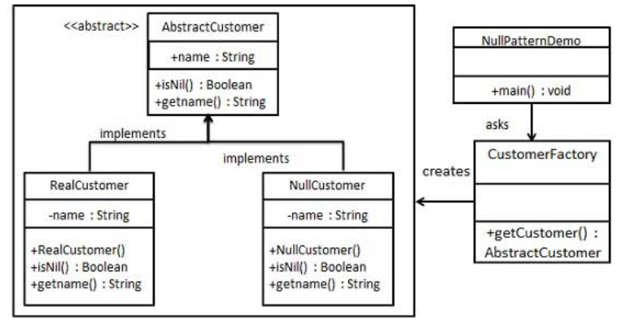

# 空对象模式 - Null Object Pattern

## 动机 - Motivation

> In most object-oriented languages, such as Java or C#, references may be null. These references need to be checked to ensure they are not null before invoking any methods, because methods typically cannot be invoked on null references.

## 描述 - Description

Instead of using a null reference to convey absence of an object (for instance, a non-existent customer), one uses an object which implements the expected interface, but <u>whose method body is empty</u>. 

The advantage of this approach over a working default implementation is that a null object is very predictable and has no side effects: <u>*it does nothing*</u>.

## Class Diagram



## 案例 - Example

```javascript
class Dog {
  sound() {
    return 'bark';
  }
}

class NullAnimal {
  sound() {
    return null;
  }
}

function getAnimal(type) {
  return type === 'dog' ? new Dog() : new NullAnimal();
}

['dog', null].map((animal) => getAnimal(animal).sound());
// Returns ["bark", null]
```

# Reference

* https://www.runoob.com/design-pattern/null-object-pattern.html