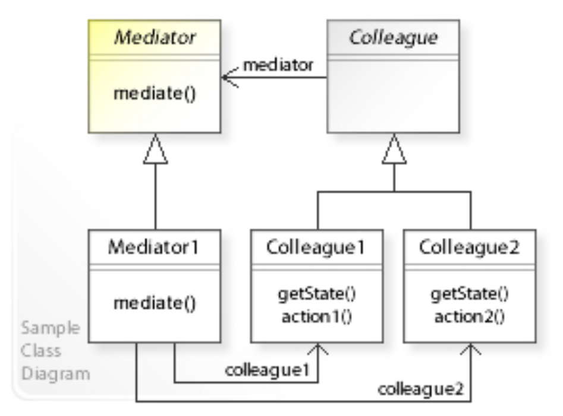
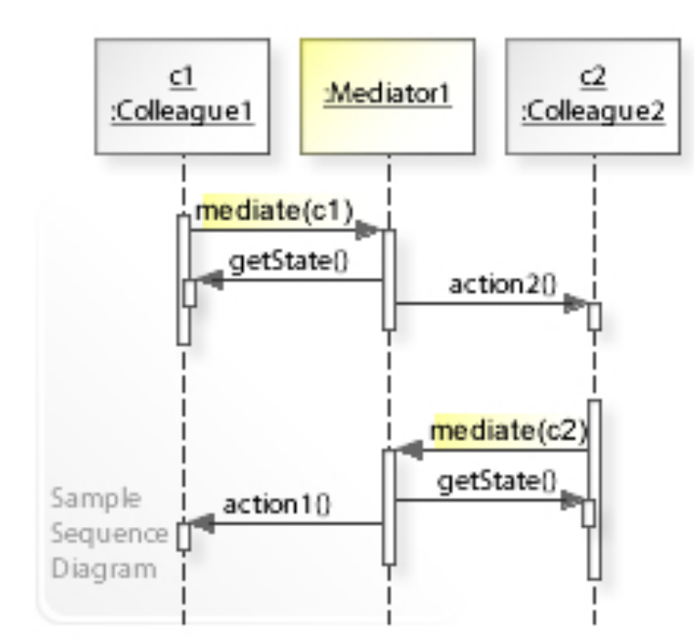

# 中介者模式 - Mediator Pattern

>   Mediator模式（中介者模式）是一种软件设计模式，它的目的是降低组件之间的耦合性，使得组件之间的交互更加灵活和可扩展。Mediator模式的核心思想是通过引入一个中介者对象来协调多个组件之间的通信和交互。

在Mediator模式中，每个组件都持有一个对中介者对象的引用，当组件需要与其他组件交互时，它们不直接与其他组件进行通信，而是将请求发送给中介者对象，由中介者对象来协调和处理请求。这样，各个组件之间的耦合性就降低了，因为它们不需要了解其他组件的具体实现，只需要与中介者对象进行交互。

>   举个例子，假设我们有一个聊天室程序，里面有多个用户和一个聊天室对象。用户之间可以互相发送消息，但是它们不需要知道对方的具体实现，而只需要将消息发送给聊天室对象，由聊天室对象来将消息分发给其他用户。在这个例子中，聊天室对象就是中介者对象，它协调了多个用户之间的通信和交互。

## Class Diagram

## Sequence Diagram

# Reference

*   https://en.wikipedia.org/wiki/Mediator_pattern