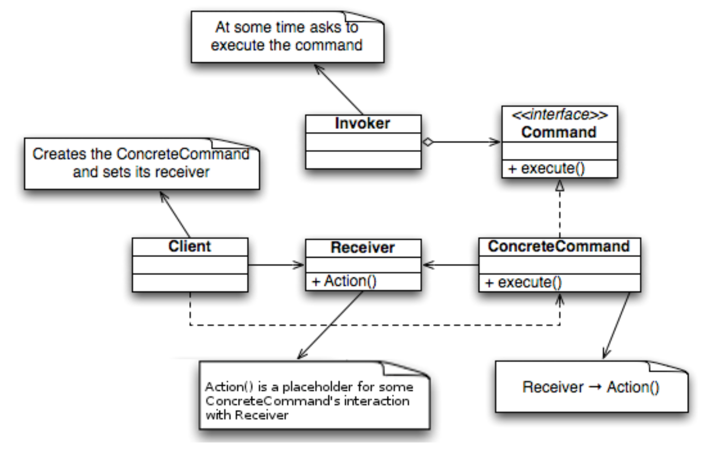
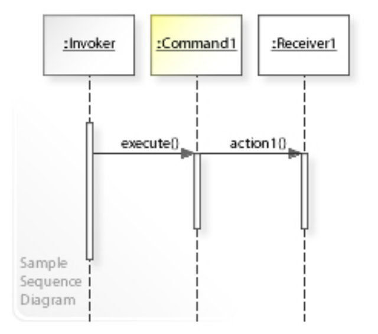

# 命令模式 - Command Pattern

>   In object-oriented programming, the command pattern is a behavioral design pattern in which an object (command) is used to encapsulate all information needed to perform an action or trigger an event at a later time.
>
>   在Command模式中，一个命令对象封装了所有必要的信息，使得它能够调用一个特定的方法，并对该方法执行的对象、方法名和参数进行解耦。这种解耦的方式允许我们将命令对象保存在队列中或者日志中，并在需要时对它们进行重放或撤销。

Command pattern包含以下几个角色：

1.  Command：定义一个命令接口，包含一个执行方法。
2.  ConcreteCommand：实现Command接口，具体实现命令的执行方法。
3.  Invoker：发送者，负责调用命令对象的执行方法。
4.  Receiver：接收者，负责执行命令的具体操作。
5.  Client：客户端，创建具体的命令对象并设置其接收者，将命令对象传递给发送者。

>   Four terms always associated with the command pattern are *command*, *receiver*, *invoker* and *client*. A *command* object knows about *receiver* and invokes a method of the receiver. Values for parameters of the receiver method are stored in the command. The receiver object to execute these methods is also stored in the command object by aggregation. The *receiver* then does the work when the `execute()` method in *command* is called. An *invoker* object knows how to execute a command, and optionally does bookkeeping about the command execution. The invoker does not know anything about a concrete command, it knows only about the command *interface*. Invoker object(s), command objects and receiver objects are held by a *client* object, the *client* decides which receiver objects it assigns to the command objects, and which commands it assigns to the invoker. The client decides which commands to execute at which points. To execute a command, it passes the command object to the invoker object.

## Class Diagram

## Sequence Diagram

# Reference

*   https://en.wikipedia.org/wiki/Command_pattern