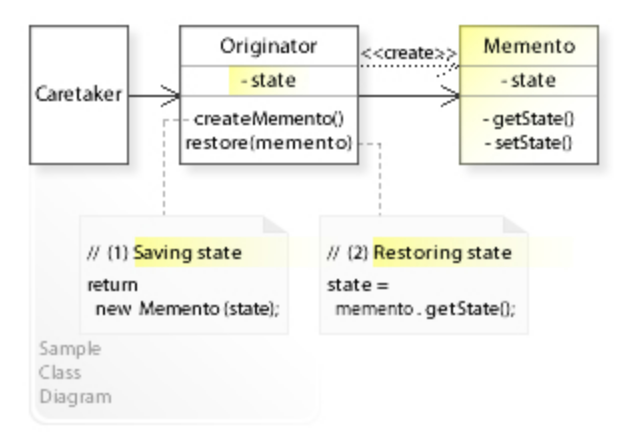
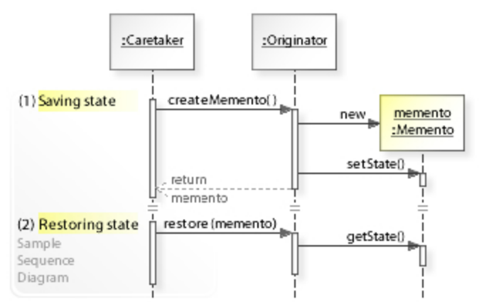

# 备忘录模式 - Memento Pattern

>   Memento pattern是一种行为设计模式，它允许在不破坏对象封装的情况下，捕获并保存对象的内部状态，并在需要时恢复对象的状态。

在Memento pattern中，由三个核心角色组成：

1.  <u>Originator</u>（发起人）：它是需要保存状态的对象。它创建一个包含自身状态的Memento对象，并且可以使用该对象来还原其状态。
2.  <u>Memento</u>（备忘录）：它存储Originator对象的状态。它具有两个接口，Caretaker（负责人）只能看到其中一个接口，用于检查备忘录的元数据，而Originator则可以使用第二个接口来访问其状态。
3.  <u>Caretaker</u>（负责人）：它负责保存Memento对象，并在需要时将其返回给Originator。它并不了解备忘录的内部状态，只能将其返回给Originator。

当需要保存Originator对象的状态时，Originator创建一个包含其状态的Memento对象，并将其传递给Caretaker。Caretaker将Memento对象保存在某个位置（例如，一个栈中），并在需要时将其返回给Originator。Originator使用Memento对象来还原其状态。

>   Memento pattern可以帮助我们避免在对象封装性方面做出妥协，同时仍然能够轻松地捕获和恢复对象的状态。它在许多场景中都非常有用，例如撤销操作、事务处理、快照等。

## Class Diagram



## Sequence Diagram



## 代码案例 - Code Example (Python)

```python
class Memento:
    def __init__(self, state) -> None:
        self._state = state

    def get_saved_state(self):
        return self._state

class Originator:
    _state = ""

    def set(self, state) -> None:
        print("Originator: Setting state to", state)
        self._state = state

    def save_to_memento(self) -> Memento:
        print("Originator: Saving to Memento.")
        return Memento(self._state)

    def restore_from_memento(self, memento) -> None:
        self._state = memento.get_saved_state()
        print("Originator: State after restoring from Memento:", self._state)

saved_states = []
originator = Originator()
originator.set("State1")
originator.set("State2")
saved_states.append(originator.save_to_memento())

originator.set("State3")
saved_states.append(originator.save_to_memento())

originator.set("State4")

originator.restore_from_memento(saved_states[1])
```

# Reference

*   https://en.wikipedia.org/wiki/Memento_pattern