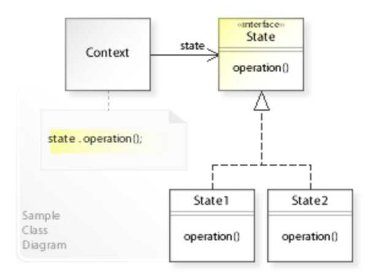
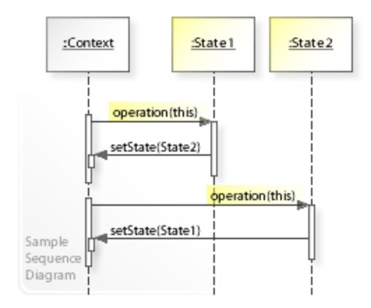

# 状态模式 - State Pattern

>   你发现你的代码里面存在一个很长的`if else`列表，而这些分支都是因为不同状态下执行的操作不一样时考虑使用此模式.

>   它的目的是让一个对象在其内部状态改变时，改变它的行为。<u>State模式的核心思想是将对象的行为和状态分离</u>，将状态抽象为独立的类，使得状态的切换可以独立于对象的行为。


## Class Diagram



## Sequence Diagram



## 与策略模式的区别

状态模式与策略模式的UML类图都是一样的，从表面上看他们非常相似。特别是将状态切换任务放在Context中做的时候就更像了，但是其背后的思想却非常不同。

*   **策略模式**定义了一组可互相代替的算法，这一组算法对象完成的是同一个任务，只是使用的方式不同，例如同样是亿万富翁，马云通过卖东西实现，而王思聪通过继承实现。
*   **状态模式**不同的状态完成的任务完全不一样。

## Code Example

```java
public interface LogisticsState {
    void doAction(JdLogistics context);
}
```

```java
public class JdLogistics {
    private LogisticsState logisticsState;

    public void setLogisticsState(LogisticsState logisticsState) {
        this.logisticsState = logisticsState;
    }

    public LogisticsState getLogisticsState() {
        return logisticsState;
    }

    public void doAction(){
        Objects.requireNonNull(logisticsState);
        logisticsState.doAction(this);
    }
}
```

```java
// state

public class OrderState implements LogisticsState {
    @Override
    public void doAction(JdLogistics context) {
        System.out.println("商家已经接单，正在处理中...");
    }
}

public class ProductOutState implements LogisticsState {
    @Override
    public void doAction(JdLogistics context) {
        System.out.println("商品已经出库...");
    }
}
```

```java
public class StateClient {

    public void buyKeyboard() {
        //状态的保持与切换者
        JdLogistics jdLogistics = new JdLogistics();

        //接单状态
        OrderState orderState = new OrderState();
        jdLogistics.setLogisticsState(orderState);
        jdLogistics.doAction();

        //出库状态
        ProductOutState productOutState = new ProductOutState();
        jdLogistics.setLogisticsState(productOutState);
        jdLogistics.doAction();

        //运输状态
        TransportState transportState = new TransportState();
        jdLogistics.setLogisticsState(transportState);
        jdLogistics.doAction();
    }
}
```

```
家已经接单，正在处理中...
商品已经出库...
商品正在运往天津分发中心
```

# Reference

*   https://en.wikipedia.org/wiki/State_pattern
*   秒懂设计模式之状态模式（State Pattern） - shusheng007的文章 - 知乎 https://zhuanlan.zhihu.com/p/369732910