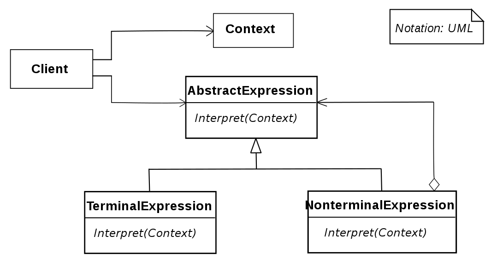
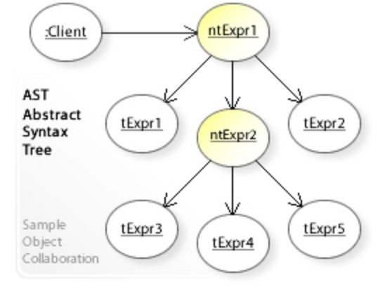

# 解释器模式 - Interpreter Pattern

>   In computer programming, the interpreter pattern is a design pattern that specifies how to evaluate sentences in a language. The basic idea is to have a class for each symbol (terminal or nonterminal) in a specialized computer language. 
>
>   The syntax tree of a sentence in the language is an instance of the composite pattern and is used to evaluate (interpret) the sentence for a client.

在Interpreter pattern中，由以下几个角色组成：

1.  AbstractExpression（抽象表达式）：定义一个解释器接口，该接口包含一个interpret方法。
2.  TerminalExpression（终端表达式）：实现AbstractExpression接口，并且它表示语法中的一个终端符号。
3.  NonterminalExpression（非终端表达式）：实现AbstractExpression接口，并且它表示语法中的一个非终端符号，通常由多个终端符号组成。
4.  Context（环境）：包含需要解释的信息。
5.  Client（客户端）：创建并配置一个解释器对象，并且提供需要解释的信息给解释器进行解释。

### What solution does the Interpreter design pattern describe?

*   Define a grammar for a simple language by defining an `Expression` class hierarchy and implementing an `interpret()` operation.
*   Represent a sentence in the language by an abstract syntax tree (AST) made up of `Expression` instances.
*   Interpret a sentence by calling `interpret()` on the AST.

## Uses

*   Specialized database query languages such as SQL.
*   Specialized computer languages that are often used to describe communication protocols.
*   Most general-purpose computer languages actually incorporate several specialized languages.

## Class Diagram



## Object Diagram



## Code Example

```c#
using System;
using System.Collections.Generic;

namespace OOP;

class Program
{
    static void Main()
    {
        var context = new Context();
        var input = new MyExpression();

        var expression = new OrExpression
        {
            Left = new EqualsExpression
            {
                Left = input,
                Right = new MyExpression { Value = "4" }
            },
            Right = new EqualsExpression
            {
                Left = input,
                Right = new MyExpression { Value = "four" }
            }
        };

        input.Value = "four";
        expression.Interpret(context);
        // Output: "true" 
        Console.WriteLine(context.Result.Pop());

        input.Value = "44";
        expression.Interpret(context);
        // Output: "false"
        Console.WriteLine(context.Result.Pop());
    }
}

class Context
{
    public Stack<string> Result = new Stack<string>();
}

interface IExpression
{
    void Interpret(Context context);
}

abstract class OperatorExpression : IExpression
{
    public IExpression Left { private get; set; }
    public IExpression Right { private get; set; }

    public void Interpret(Context context)
    {
        Left.Interpret(context);
        string leftValue = context.Result.Pop();

        Right.Interpret(context);
        string rightValue = context.Result.Pop();

        DoInterpret(context, leftValue, rightValue);
    }

    protected abstract void DoInterpret(Context context, string leftValue, string rightValue);
}

class EqualsExpression : OperatorExpression
{
    protected override void DoInterpret(Context context, string leftValue, string rightValue)
    {
        context.Result.Push(leftValue == rightValue ? "true" : "false");
    }
}

class OrExpression : OperatorExpression
{
    protected override void DoInterpret(Context context, string leftValue, string rightValue)
    {
        context.Result.Push(leftValue == "true" || rightValue == "true" ? "true" : "false");
    }
}

class MyExpression : IExpression
{
    public string Value { private get; set; }

    public void Interpret(Context context)
    {
        context.Result.Push(Value);
    }
}
```


# Reference

*   https://en.wikipedia.org/wiki/Interpreter_pattern