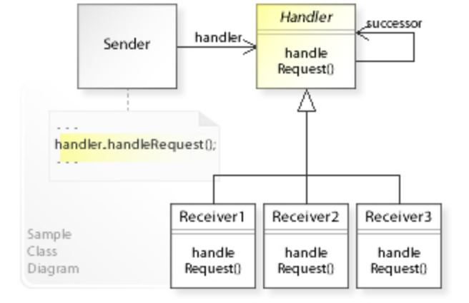
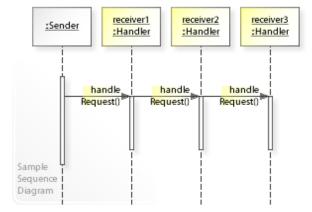

# 责任链模式 - Chain-of-Responsibility Pattern

>   Chain-of-responsibility pattern是一种行为设计模式，指的是为了避免请求发送者与多个请求处理者耦合在一起，于是将所有请求的处理者通过前一对象记住其下一个对象的引用而连成一条链；当有请求发生时，可将请求沿着这条链传递，直到有对象处理它为止。
>
>   In object-oriented design, the chain-of-responsibility pattern is a design pattern consisting of a source of command objects and a series of processing objects. Each processing object contains logic that defines the types of command objects that it can handle; the rest are passed to the next processing object in the chain. A mechanism also exists for adding new processing objects to the end of this chain. 
>
>   Thus, the chain of responsibility is an object oriented version of the if... else if... else if....... else... endif idiom, with the benefit that the condition–action blocks can be dynamically rearranged and reconfigured at runtime.

**责任链的优点**

1.   责任链模式是一种灵活版本的if else条件处理语句，它降低了对象之间的耦合度，每个具体的处理子类只需要负责处理自己的请求即可。
2.   增加了拓展性，处理新的请求只需要增加具体的处理该请求的子类即可，符合了开闭原则。
3.   每个对象只需保持一个指向其后继者的引用，不需保持其他所有处理者的引用，简化了对象之间的连接。
4.   符合单一职责原则，每个类都有自己的明确职责方位，只需要处理自己该处理的工作，不该处理的传递给下一个对象完成。

**责任链的缺点**

1.   性能较低，如果没有找到正确的处理类，那么所有的条件都需要执行，如果责任链过长，那么会导致性能较低。
2.   因为没有明确的接受者，所以可能存在请求不被处理的情况，比如上面例子中的请求如果是困了，那么就没有合适的处理子类处理这个请求了。

## Class Diagram



## Sequence Diagram



## 代码案例 - Code Example

```c#
namespace ChainOfResponsibility;

[Flags]
public enum LogLevel
{
    None = 0,                 //        0
    Info = 1,                 //        1
    Debug = 2,                //       10
    Warning = 4,              //      100
    Error = 8,                //     1000
    FunctionalMessage = 16,   //    10000
    FunctionalError = 32,     //   100000
    All = 63                  //   111111
}

/// <summary>
/// Abstract Handler in chain of responsibility pattern.
/// </summary>
public abstract class Logger
{
    protected LogLevel logMask;

    // The next Handler in the chain
    protected Logger next;

    public Logger(LogLevel mask)
    {
        this.logMask = mask;
    }

    /// <summary>
    /// Sets the Next logger to make a list/chain of Handlers.
    /// </summary>
    public Logger SetNext(Logger nextlogger)
    {
        Logger lastLogger = this;

        while (lastLogger.next != null)
        {
            lastLogger = lastLogger.next;
        }

        lastLogger.next = nextlogger;
        return this;
    }

    public void Message(string msg, LogLevel severity)
    {
        if ((severity & logMask) != 0) // True only if any of the logMask bits are set in severity
        {
            WriteMessage(msg);
        }
        if (next != null) 
        {
            next.Message(msg, severity); 
        }
    }

    abstract protected void WriteMessage(string msg);
}

public class ConsoleLogger : Logger
{
    public ConsoleLogger(LogLevel mask)
        : base(mask)
    { }

    protected override void WriteMessage(string msg)
    {
        Console.WriteLine("Writing to console: " + msg);
    }
}

public class EmailLogger : Logger
{
    public EmailLogger(LogLevel mask)
        : base(mask)
    { }

    protected override void WriteMessage(string msg)
    {
        // Placeholder for mail send logic, usually the email configurations are saved in config file.
        Console.WriteLine("Sending via email: " + msg);
    }
}

class FileLogger : Logger
{
    public FileLogger(LogLevel mask)
        : base(mask)
    { }

    protected override void WriteMessage(string msg)
    {
        // Placeholder for File writing logic
        Console.WriteLine("Writing to Log File: " + msg);
    }
}

public class Program
{
    public static void Main(string[] args)
    {
        // Build the chain of responsibility
        Logger logger;
        logger = new ConsoleLogger(LogLevel.All)
                         .SetNext(new EmailLogger(LogLevel.FunctionalMessage | LogLevel.FunctionalError))
                         .SetNext(new FileLogger(LogLevel.Warning | LogLevel.Error));

        // Handled by ConsoleLogger since the console has a loglevel of all
        logger.Message("Entering function ProcessOrder().", LogLevel.Debug);
        logger.Message("Order record retrieved.", LogLevel.Info);

        // Handled by ConsoleLogger and FileLogger since filelogger implements Warning & Error
        logger.Message("Customer Address details missing in Branch DataBase.", LogLevel.Warning);
        logger.Message("Customer Address details missing in Organization DataBase.", LogLevel.Error);

        // Handled by ConsoleLogger and EmailLogger as it implements functional error
        logger.Message("Unable to Process Order ORD1 Dated D1 For Customer C1.", LogLevel.FunctionalError);

        // Handled by ConsoleLogger and EmailLogger
        logger.Message("Order Dispatched.", LogLevel.FunctionalMessage);
    }
}
 
/* Output
Writing to console: Entering function ProcessOrder().
Writing to console: Order record retrieved.
Writing to console: Customer Address details missing in Branch DataBase.
Writing to Log File: Customer Address details missing in Branch DataBase.
Writing to console: Customer Address details missing in Organization DataBase.
Writing to Log File: Customer Address details missing in Organization DataBase.
Writing to console: Unable to Process Order ORD1 Dated D1 For Customer C1.
Sending via email: Unable to Process Order ORD1 Dated D1 For Customer C1.
Writing to console: Order Dispatched.
Sending via email: Order Dispatched.
*/
```


# Reference

*   https://en.wikipedia.org/wiki/Chain-of-responsibility_pattern
*   https://zhuanlan.zhihu.com/p/85930079
*   https://zhuanlan.zhihu.com/p/512558801