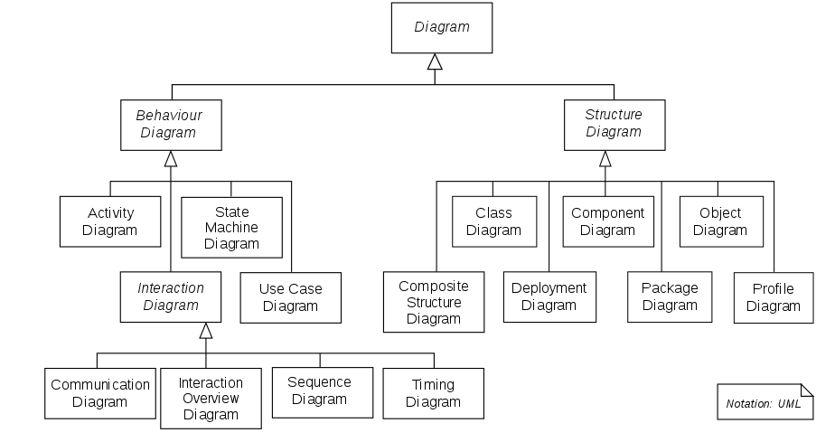
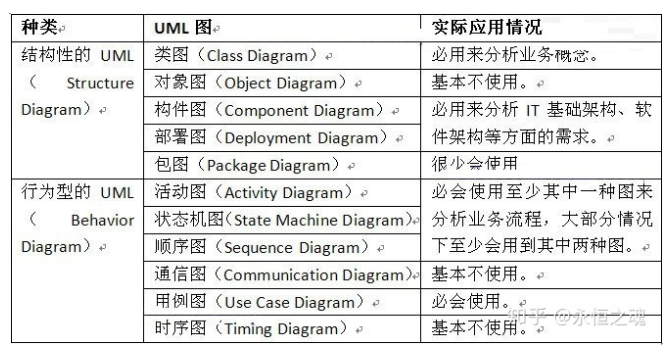

# 统一建模语言 - Unified Model Language （UML）

[UML](https://zh.wikipedia.org/wiki/统一建模语言) 是<u>统一建模语言</u>的简称，它是一种由一整套图表组成的标准化建模语言。

* UML用于帮助系统开发人员阐明，展示，构建和记录软件系统的产出。
* UML代表了一系列在大型而复杂系统建模中被证明是成功的做法，是开发面向对象（OOP）软件和软件开发过程中非常重要的一部分。
* UML主要使用图形符号来表示软件项目的设计，使用UML可以帮助项目团队沟通、探索潜在的设计和验证软件的架构设计。

## UML图 - Diagrams

UML2中，图的类别主要分类成两种：

1. 结构性图（structure diagram）—— Structure diagrams represent the <u>static aspects of the system</u>. It emphasizes the things that must be present in the system being modeled.

    > Since structure diagrams represent the structure, they are used extensively in <u>documenting the software architecture of software systems</u>.
    >
    > e.g. component diagram, class diagram.

2. 行为性图（behavior diagram）—— Behavior diagrams represent the <u>dynamic aspect of the system</u>. It emphasizes what must happen in the system being modeled.

    > Since behavior diagrams illustrate the behavior of a system, they are used extensively to <u>describe the functionality of software systems</u>.
    >
    > e.g. activity diagram, use case diagram.

3. 交互性图（interaction diagram）—— Interaction diagrams, a subset of behavior diagrams, emphasize the <u>flow of control and data among the things in the system being modeled</u>.

    > e.g. sequence diagram, communication diagram.

# Reference

* https://en.wikipedia.org/wiki/Unified_Modeling_Language#:~:text=The%20Unified%20Modeling%20Language%20(UML,the%20design%20of%20a%20system.
* https://www.visual-paradigm.com/cn/guide/uml-unified-modeling-language/what-is-uml/
* https://zhuanlan.zhihu.com/p/109655171

> 这张图可以简单做个参考，具体使用情况根据场景而变化。
>
> （转）UML学习入门就这一篇文章 - 永恒之魂的文章 - 知乎 https://zhuanlan.zhihu.com/p/63147410
