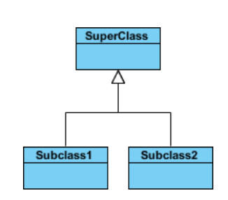

# 类图的作用 - Purpose of Class Diagram

1. Shows static structure of classifiers in a system
2. Diagram provides a basic notation for other structure diagrams prescribed by UML
3. Helpful for developers and other team members too
4. Business Analysts can use class diagrams to model systems from a business perspective

A UML class diagram is made up of:

- A set of classes and
- A set of relationships between classes

## What is a Class

A description of a group of objects all with similar roles in the system, which consists of:

- **Structural features** (attributes) define what objects of the class "know"
    - Represent the state of an object of the class
    - Are descriptions of the structural or static features of a class
- **Behavioral features** (operations) define what objects of the class "can do"
    - Define the way in which objects may interact
    - Operations are descriptions of behavioral or dynamic features of a class

# 类图中的标记法 - Class Notation

A class notation consists of three parts: class name, class attribute and class operations (method).

## Class Name

The name of the class appears in the first partition.

## Class Attributes

Attributes are shown in the second partition.

* The <u>attribute type</u> is shown after the colon.

## Class Operations (Methods)

Operations are shown in the third partition. They are services the class provides.

- The return type of a method is shown after the colon at the end of the method signature (rarely used)
- The return type of method parameters is shown after the colon following the parameter name.

## Visibility

- `+`表示 `public`
- `-`表示 `private`
- `#`表示 `protected`
- `~`表示 `default in the same packge`

# 类图中的关系 - Class Relationship

类和类、类和接口、接口和接口之间存在一定关系，UML类图中一般会有连线指明它们之间的关系。关系共有六种类型，分别是

* 泛化关系 - Inheritance (Generalization) - "is-a" relationship
* 关联关系 - Association
* 聚合关系 - Aggregation - "has-a" relationthip
* 组合关系 - Composition - "owns/contains-a" relationship
* 依赖关系 - Dependency
* 实现关系 - Implementation

## 1 - Inheritance - 泛化关系 - "is-a" relationship

* Represents an "is-a" relationship.
* *An abstract class name is shown in italics*.
* SubClass1 and SubClass2 are specializations of Super Class.

## 2 - Association - 关联关系

关联关系（Association）是指对象和对象之间的连接，它使一个对象知道另一个对象的属性和方法。在Java中，关联关系的代码表现形式为一个对象含有另一个对象的引用。<u>也就是说，如果一个对象的类代码中，包含有另一个对象的引用，那么这两个对象之间就是关联关系</u>。

双向关联: 用带双箭头的实线或者无箭头的实线双线表示。

单向关联: <u>用一个带箭头的实线表示，箭头指向被关联的对象</u>。

一个对象可以持有其它对象的数组或者集合。在UML中，通过放置多重性（multipicity）表达式在关联线的末端来表示。多重性表达式可以是一个数字、一段范围或者是它们的组合。多重性允许的表达式示例如下：

- 数字：精确的数量
- `*`或者`0..*`：表示0到多个
- `0..1`：表示0或者1个，在Java中经常用一个空引用来实现
- `1..*`：表示1到多个

## 3 - Aggregation - 聚合关系 - "has-a" relationthip

聚合（Aggregation）是关联关系的一种特例，它体现的是**`整体`与`部分`的拥有关系**，即 “has a” 的关系。此时整体与部分之间是**可分离的**，它们可以具有**各自的生命周期**，

> `部分`可以属于多个整体对象，也可以为多个整体对象共享，所以聚合关系也常称为共享关系。例如，公司部门与员工的关系，一个员工可以属于多个部门，一个部门撤消了，员工可以转到其它部门。

在UML图中，聚合关系用空心菱形加实线箭头表示，空心菱形在``整体``一方，箭头指向``部分``一方

## 4 - Composition - 组合关系 - "owns/contains-a" relationship

组合（Composition）也是关联关系的一种特例，它同样体现`整体`与`部分`间的包含关系，即 “owns/contains a” 的关系。但此时整体与部分**是不可分的**，**部分也不能给其它整体共享**，**作为整体的对象负责部分的对象的生命周期**。这种关系比聚合**更强**，也称为强聚合。如果`A`组合`B`，则`A`需要知道`B`的生存周期，即可能`A`负责生成或者释放`B`，或者`A`通过某种途径知道`B`的生成和释放。

例如，人包含头、躯干、四肢，它们的生命周期一致。当人出生时，头、躯干、四肢同时诞生。当人死亡时，作为人体组成部分的头、躯干、四肢同时死亡。

在UML图中，组合关系用实心菱形加实线箭头表示，实心菱形在整体一方，箭头指向部分一方.

## 5 - Dependency - 依赖关系

依赖（Dependency）关系是一种弱关联关系。如果对象A用到对象B，但是和B的关系不是太明显的时候，就可以把这种关系看作是依赖关系。如果对象A依赖于对象B，则 A “use a” B。比如驾驶员和汽车的关系，驾驶员使用汽车，二者之间就是依赖关系。

在UML类图中，依赖关系用一个带虚线的箭头表示，由使用方指向被使用方，表示使用方对象持有被使用方对象的引用。

依赖关系在Java中的具体代码表现形式为B为A的构造器或方法中的局部变量、方法或构造器的参数、方法的返回值，或者A调用B的静态方法。

# 案例 - Examples

