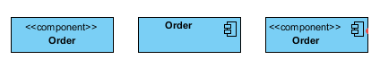
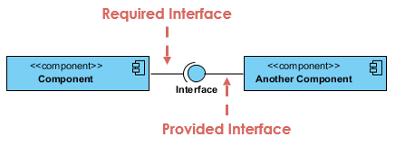
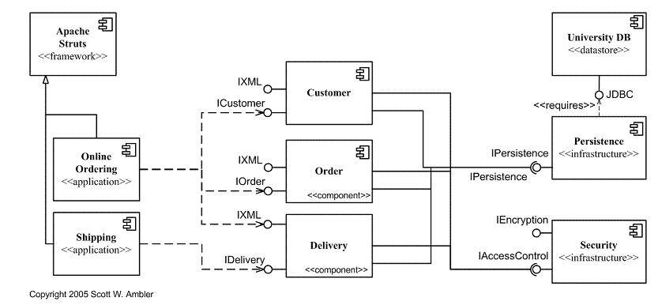

# 组件图 - Component Diagram

> A <u>component diagram</u>, also known as a UML component diagram, describes the organization and wiring of the physical components in a system. Component diagrams are often drawn to help model implementation details and double-check that every aspect of the system's required functions is covered by planned development.

## 组件图和类图的区别

> A component diagram has a <u>higher level of abstraction</u> than a Class Diagram - usually a component is implemented by one or more classes (or objects) at runtime. They are building blocks so a component can eventually encompass a large portion of a system.

## 组件图符号 - Notation

1. A rectangle with the component's name.
2. A rectangle with the component icon.
3. A rectangle with the stereotype text and/or icon.

## Interface

**Provided interface**: symbols with a complete circle at their end represent an interface that the component provides - this "lollipop" symbol is shorthand for a realization relationship of an interface classifier.

**Required Interface**: symbols with only a half circle at their end (a.k.a. sockets) represent an interface that the component requires (in both cases, the interface's name is placed near the interface symbol itself).

## 案例 - Examples

# Reference

* https://sparxsystems.com/resources/tutorials/uml2/component-diagram.html#:~:text=A%20component%20diagram%20has%20a,large%20portion%20of%20a%20system.
* https://www.visual-paradigm.com/guide/uml-unified-modeling-language/what-is-component-diagram/
* https://agilemodeling.com/style/componentDiagram.htm
