# Overview

## Example

# Representation of TM machine

## Configuration

## Graph representation

# Recognize Strings

# Turing machines that compute functions

## Example

## A TM adding two natural numbers

# Types of TM

# What Computers can and can't do

## Tiling Problem

 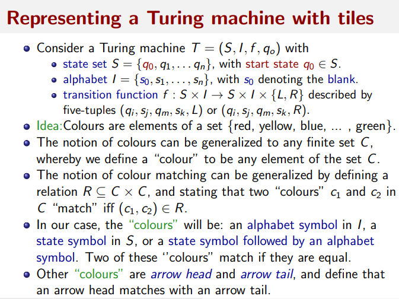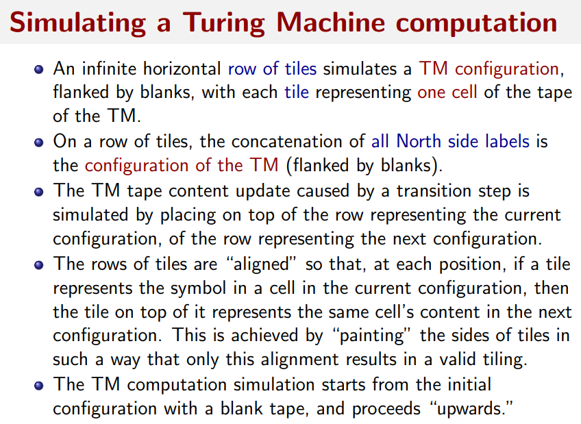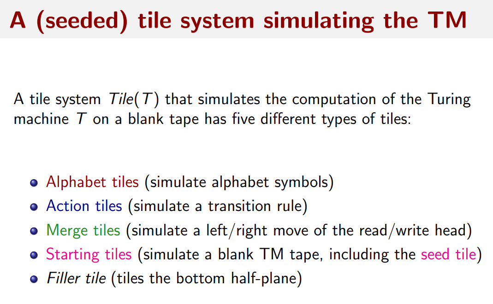

## 这里省略一些截图， 感觉属于案例类型，我懒得截屏了

## Halting Problem & (seeded) Tiling Problem

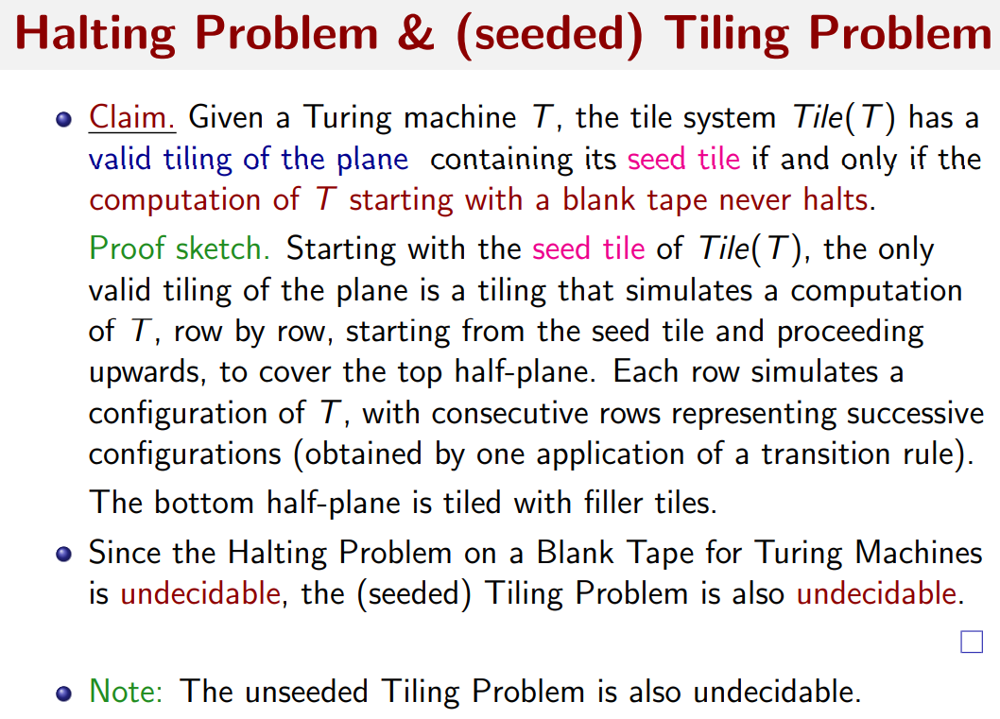

# Computability and Uncomputability

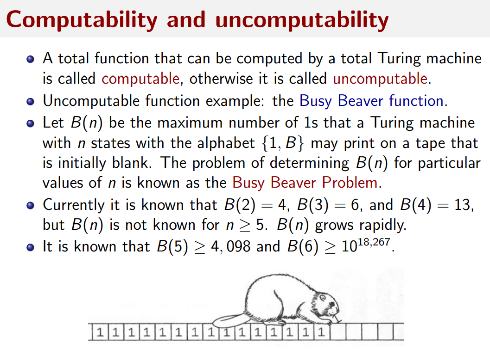

# Decidability, computability, complexity

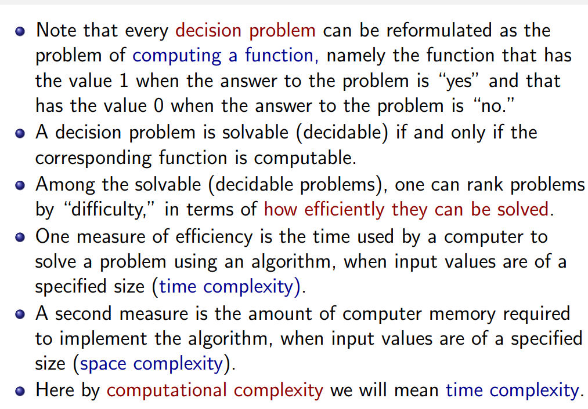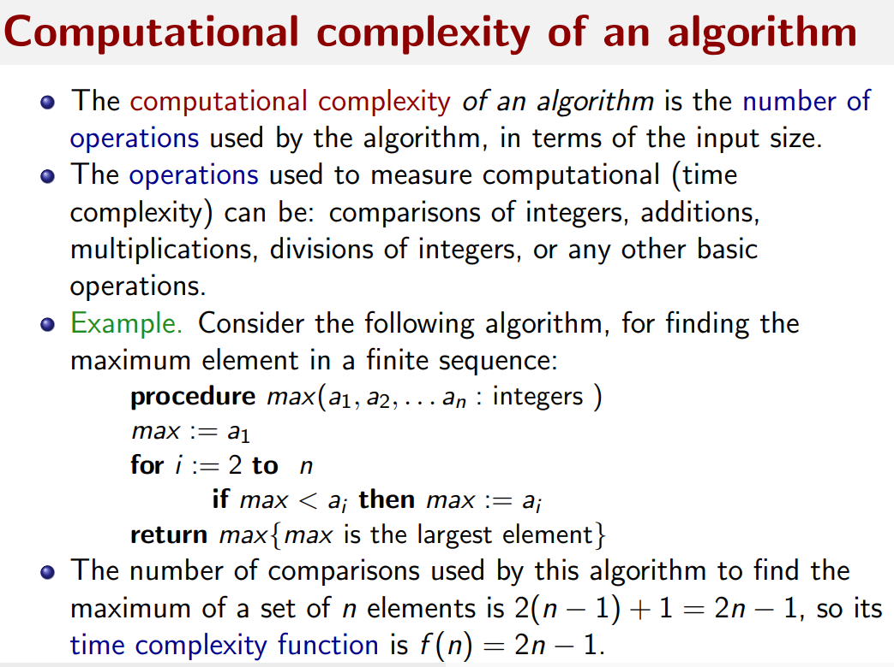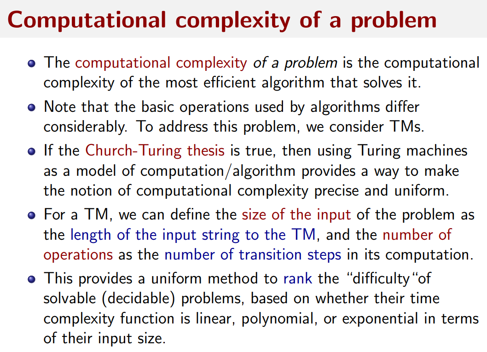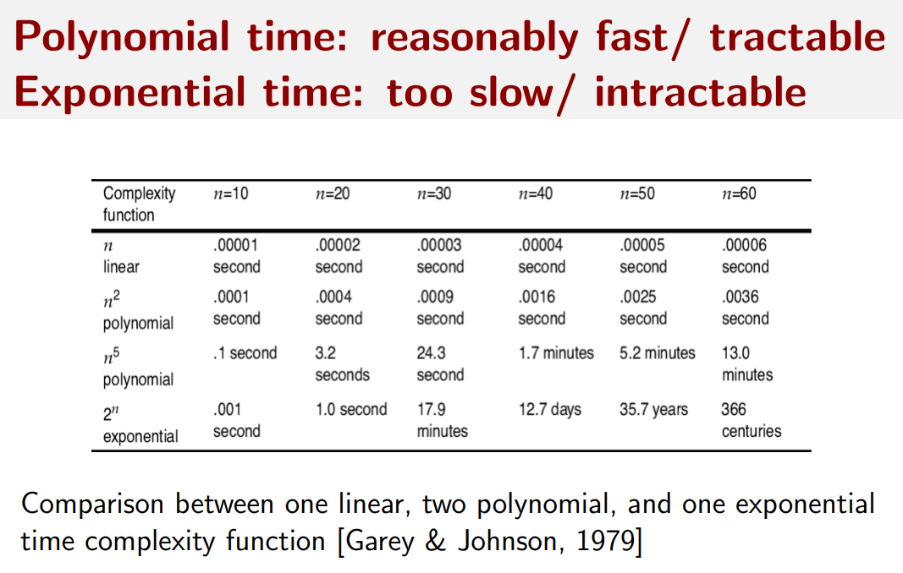

# The classes $P$ and $NP$ (deterministic vs. non-deterministic TMs)

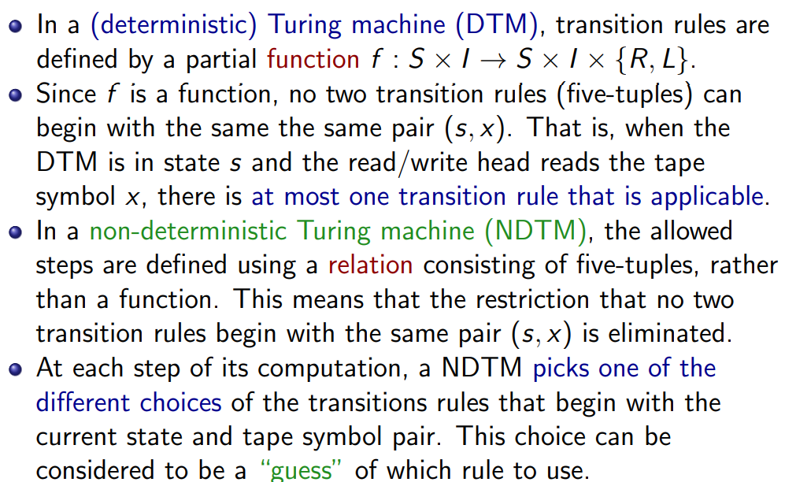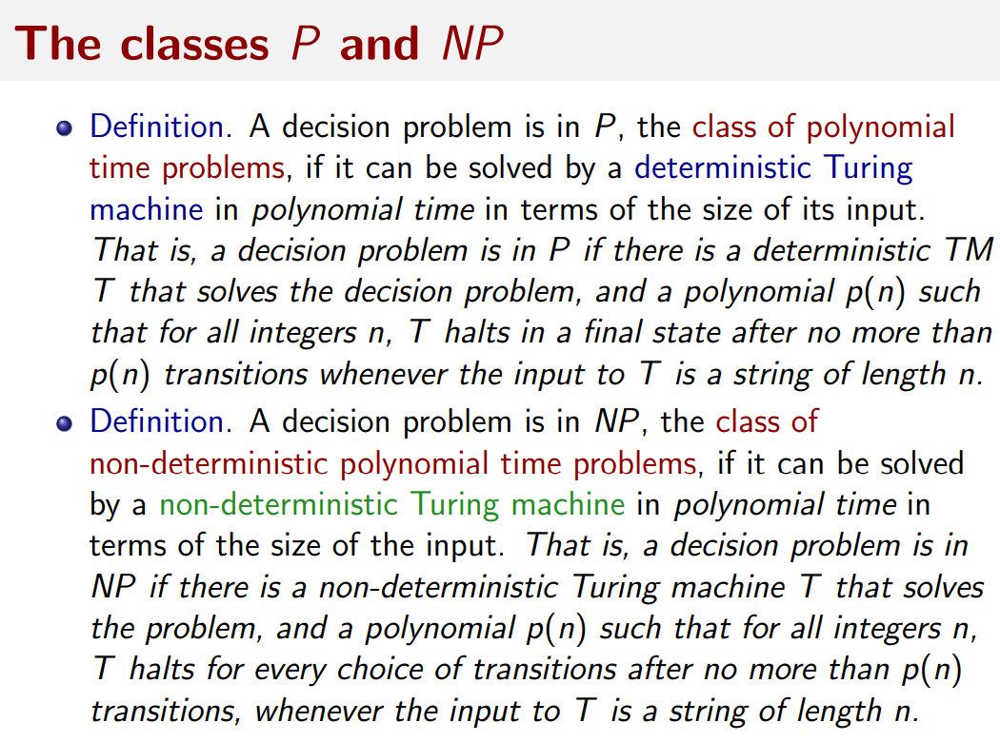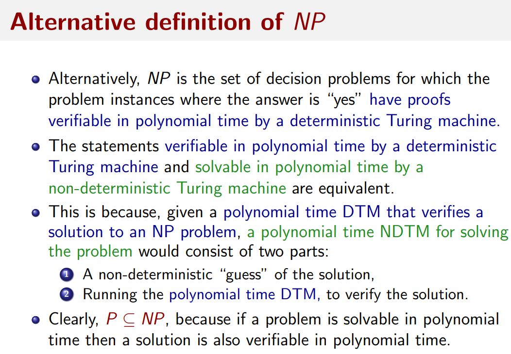

# Tractable vs. intractable problems

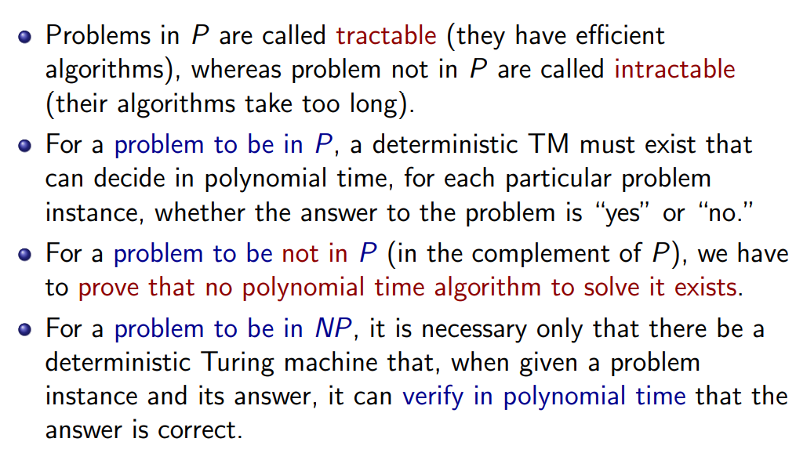

# $P$ vs. $NP$ and $NP$-complete problems

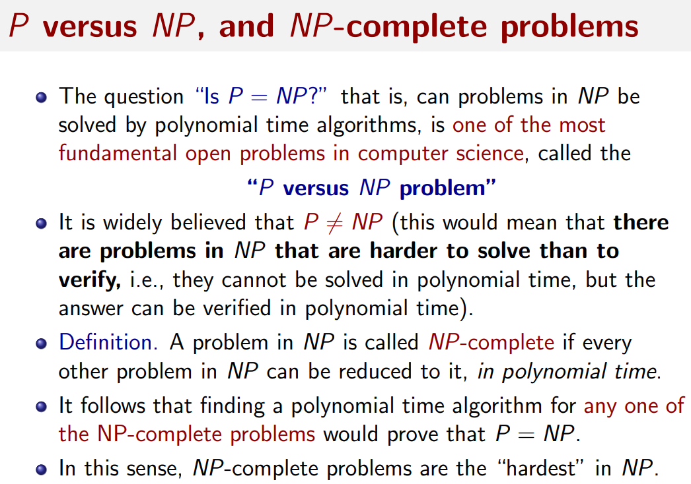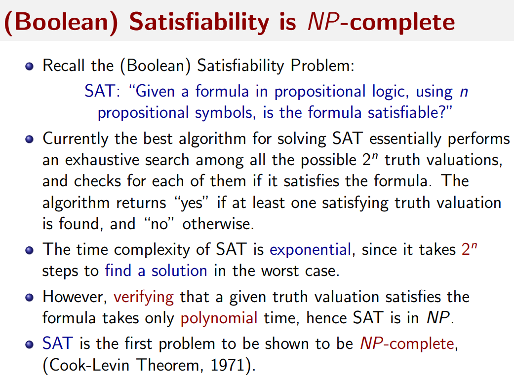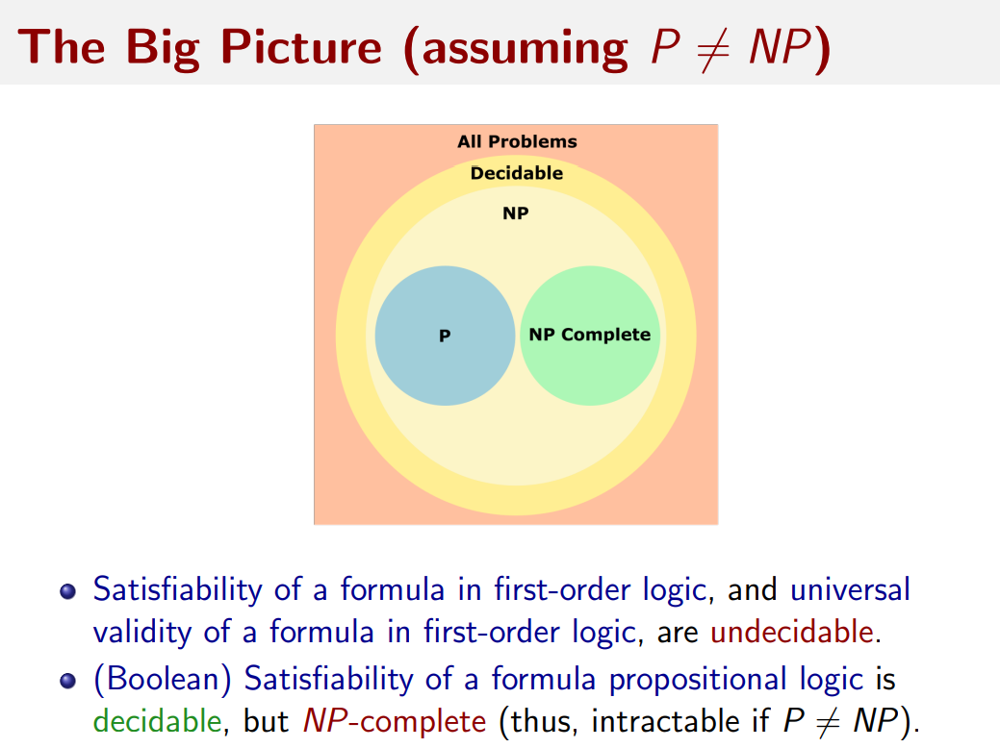

