# Invertible and Inverse Mappings

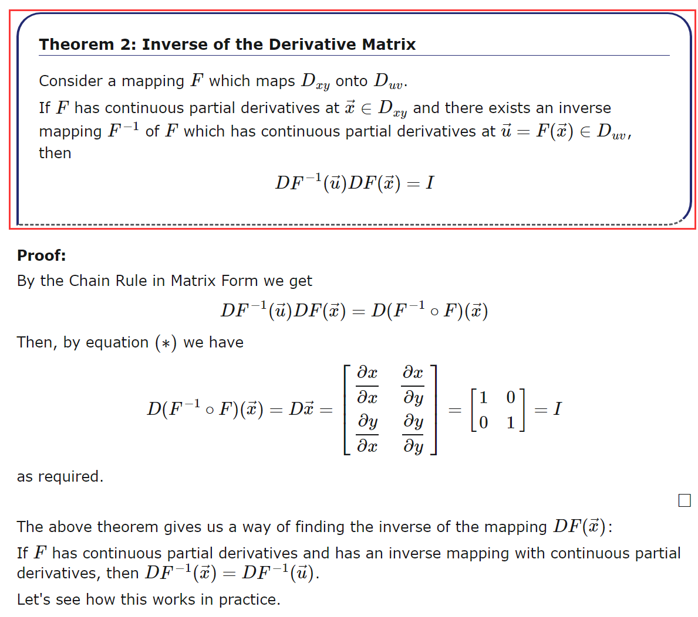

## Example

# The Jacobian of a Mapping

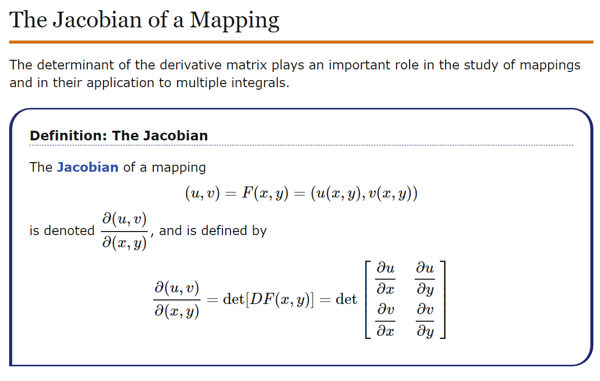

## Examples

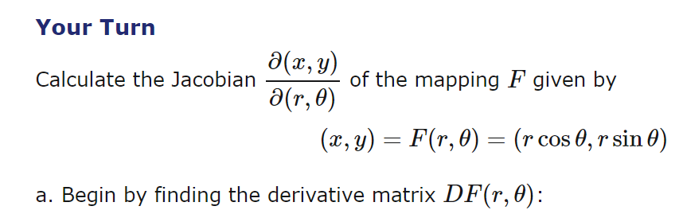

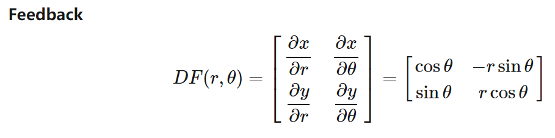

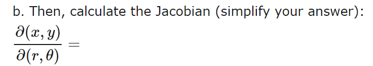

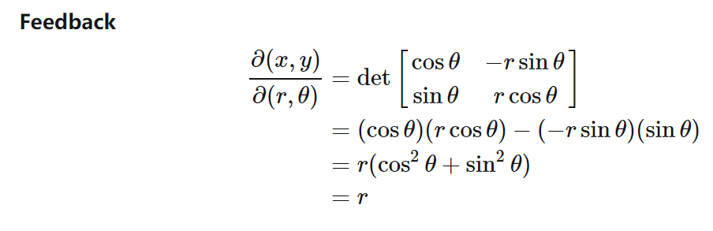

# Corollary 3 / 4 (inverse property of the jacobian)

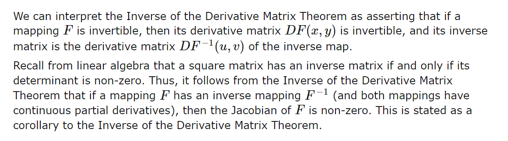

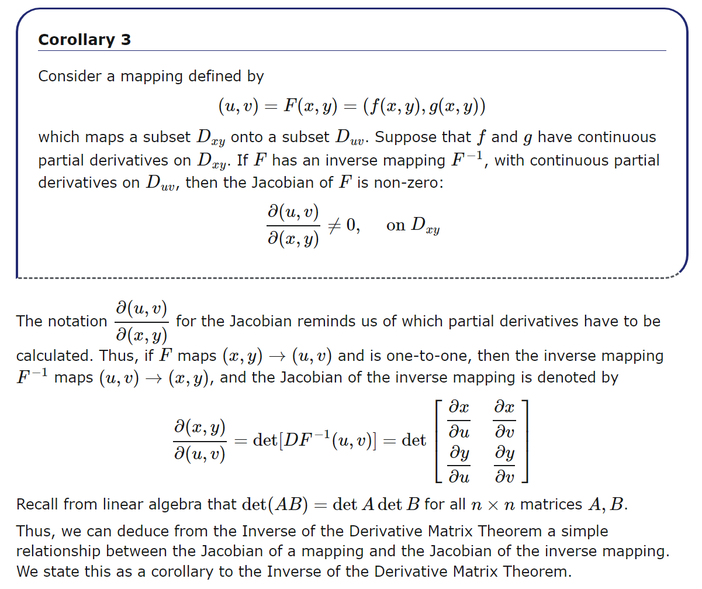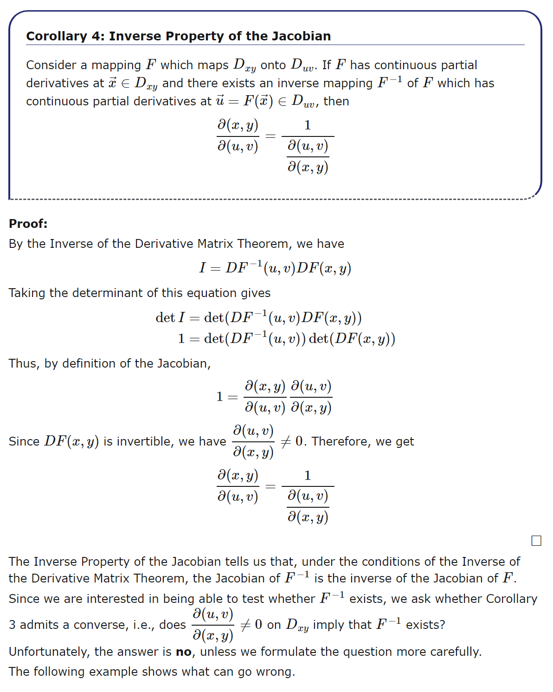

## Examples

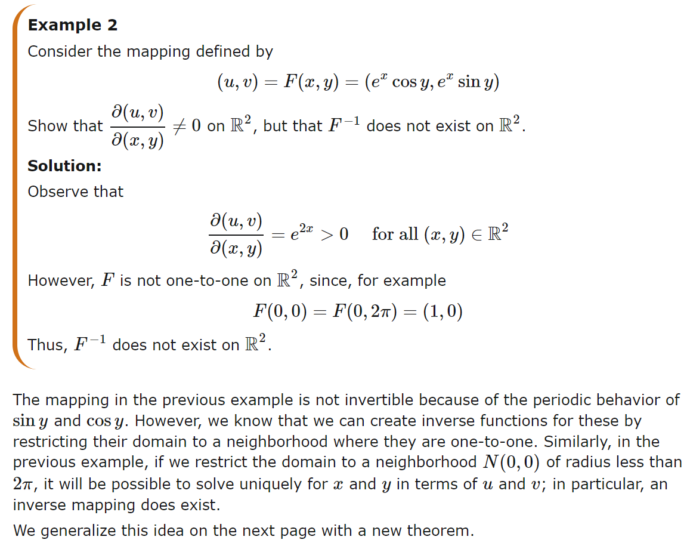

# The Inverse Mapping Theorem

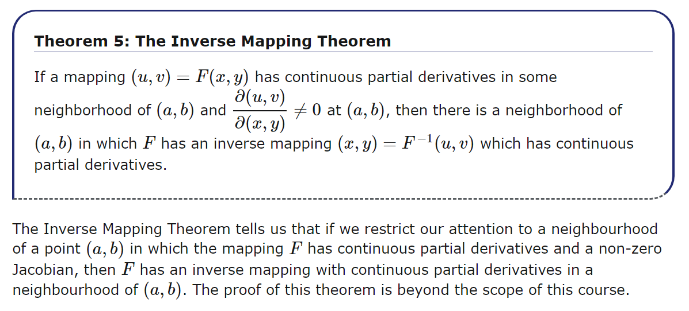

## Examples

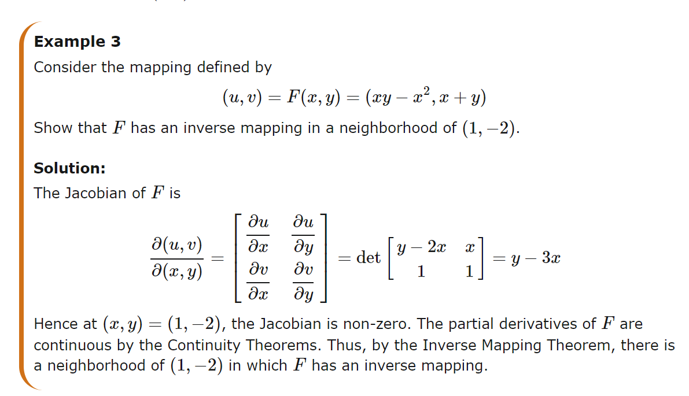

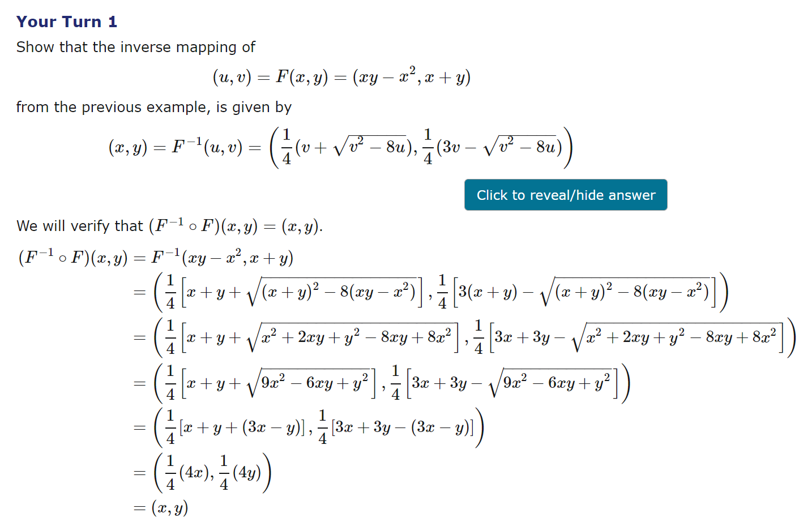

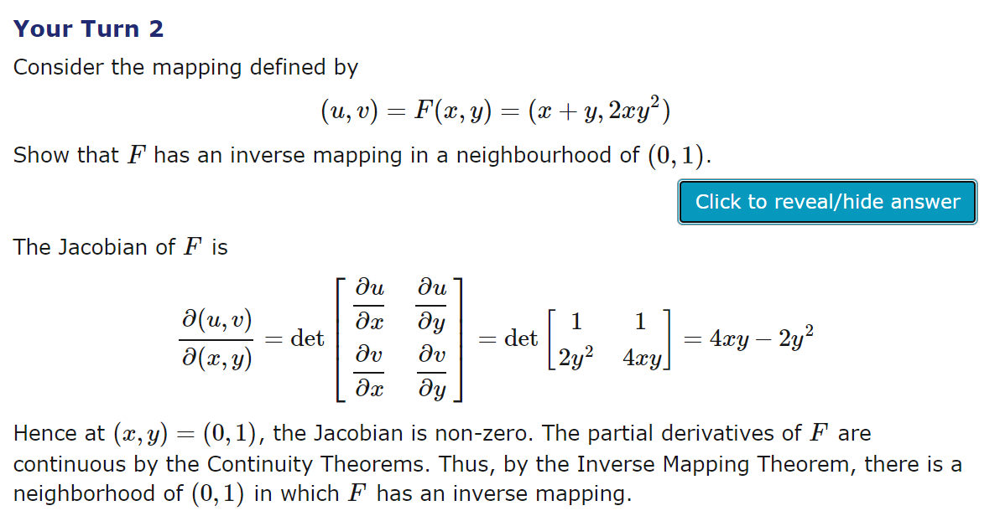

