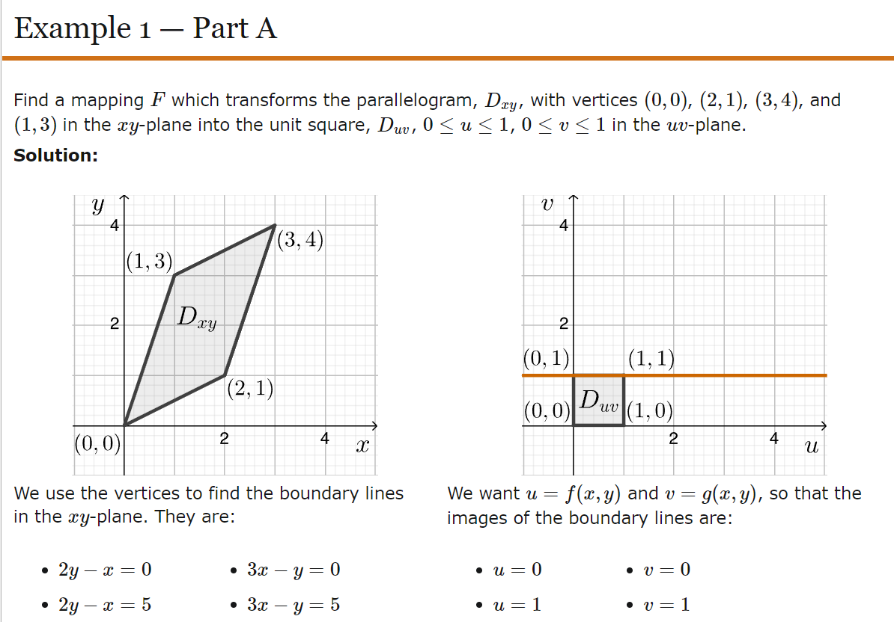
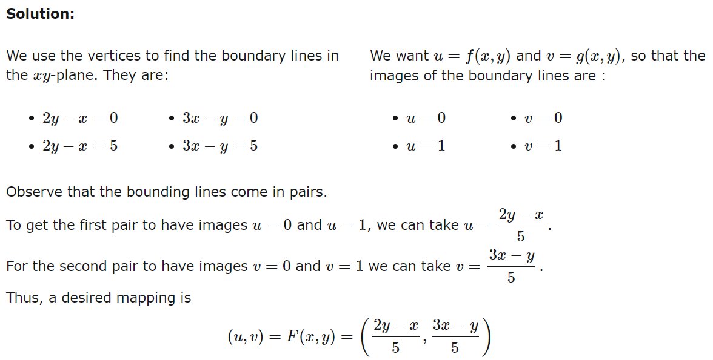
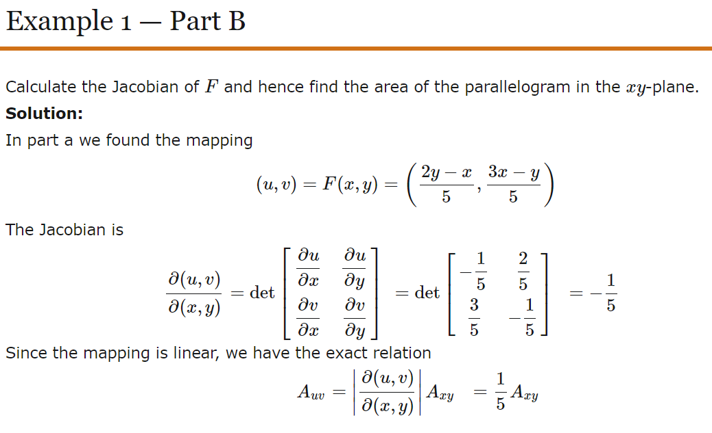
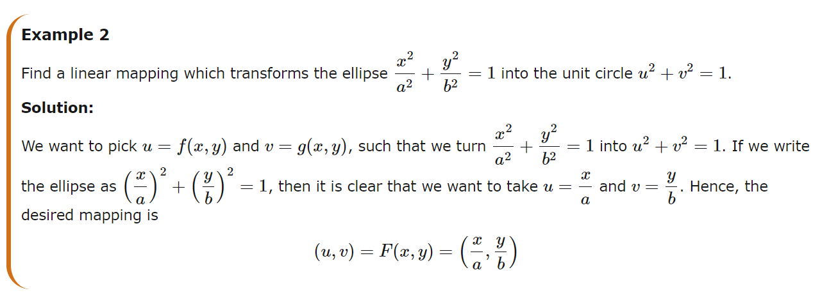
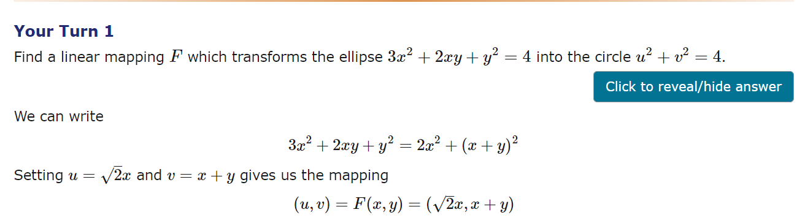
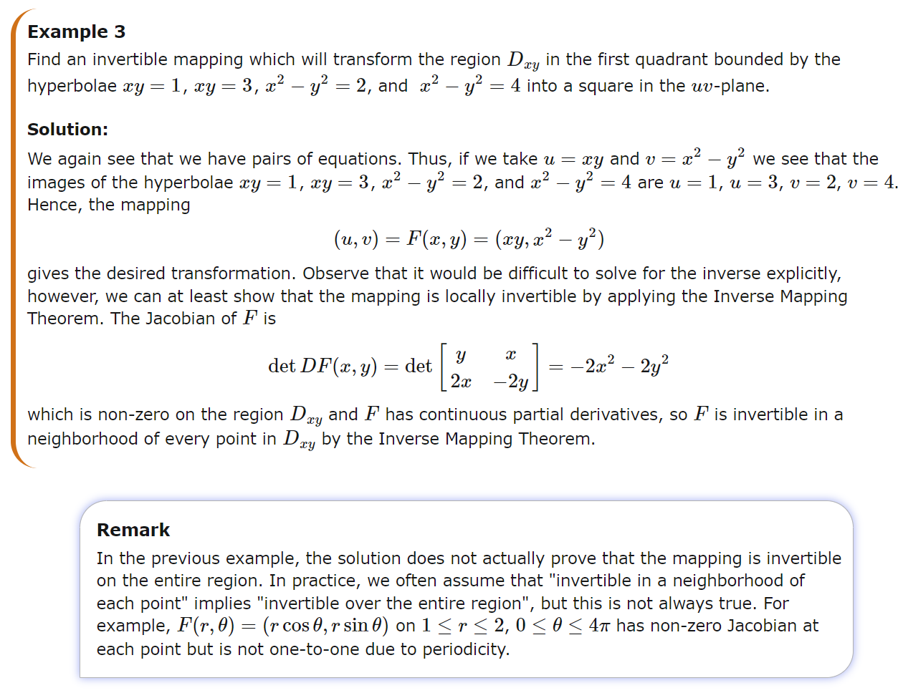
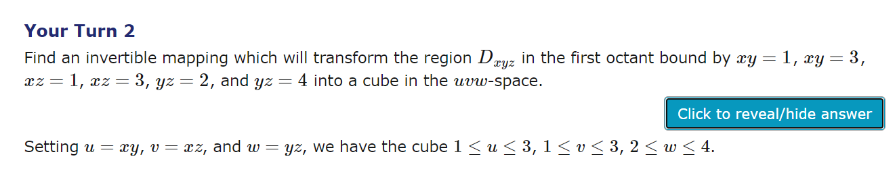

# Constructing Mappings

When working with double and triple integrals, it will be very important to be able to invent an invertible mapping which transforms one region to another, simpler region.

We demonstrate this with some examples.

## Example 1

b 

## Examples

