# Definition of Double Integrals

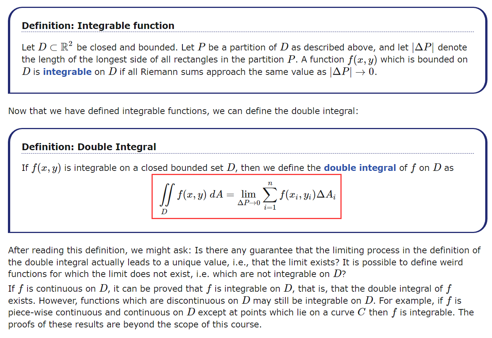

# Interpretations of the Double Integral

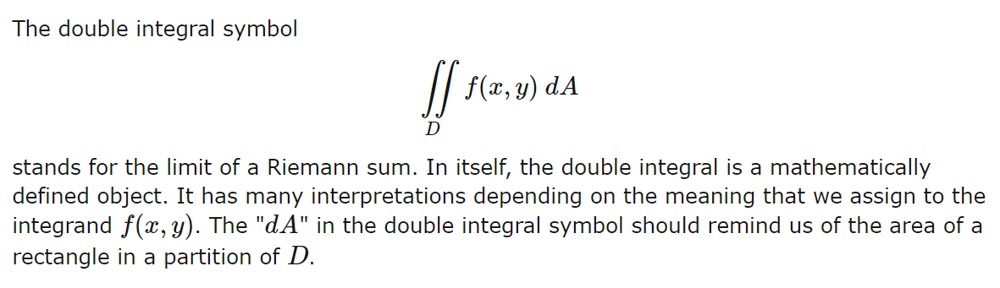

## Double Integral as Area

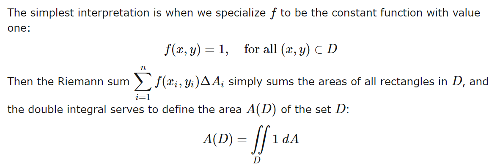

## Double Integral as Volume

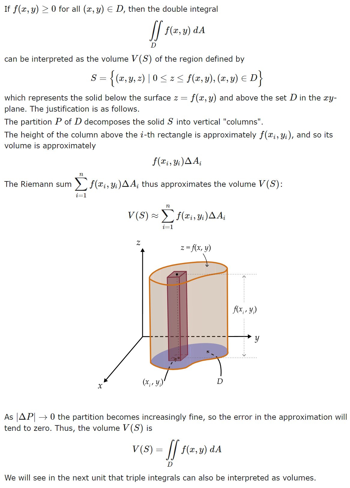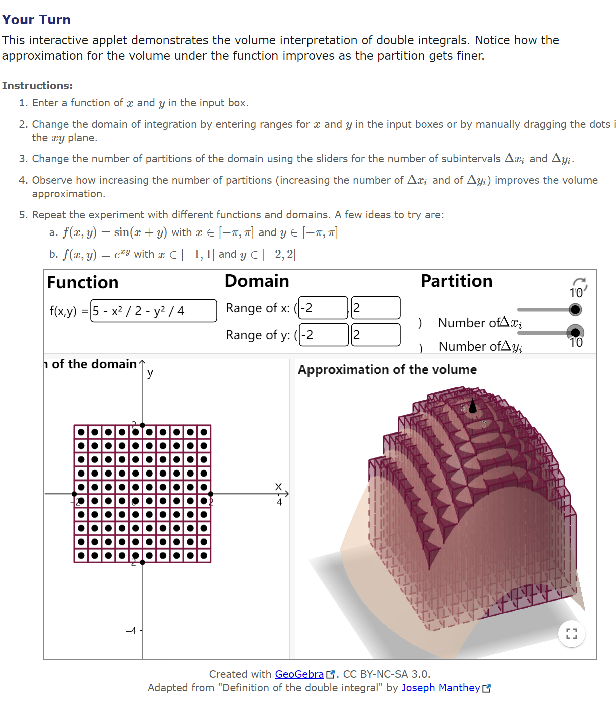

## Double Integral as Mass

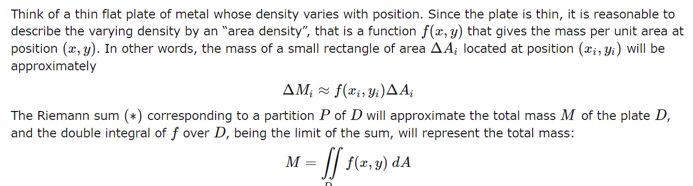

## Double Integral as Possibility

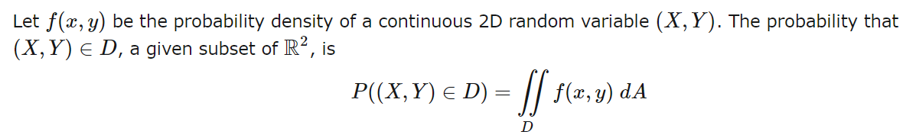

## Average Value of a Function

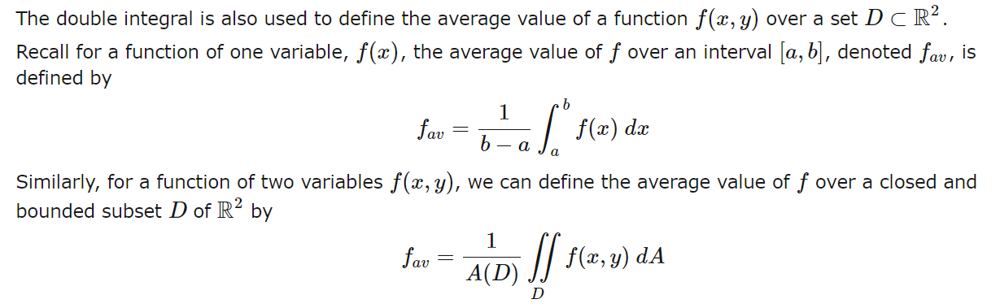

# Properties of the Double Integral

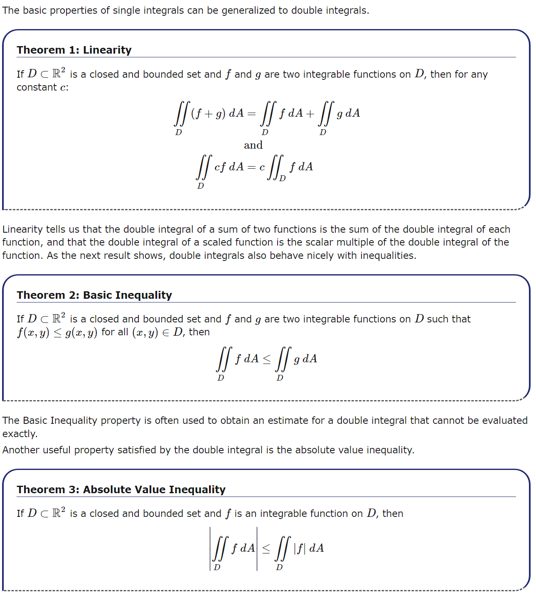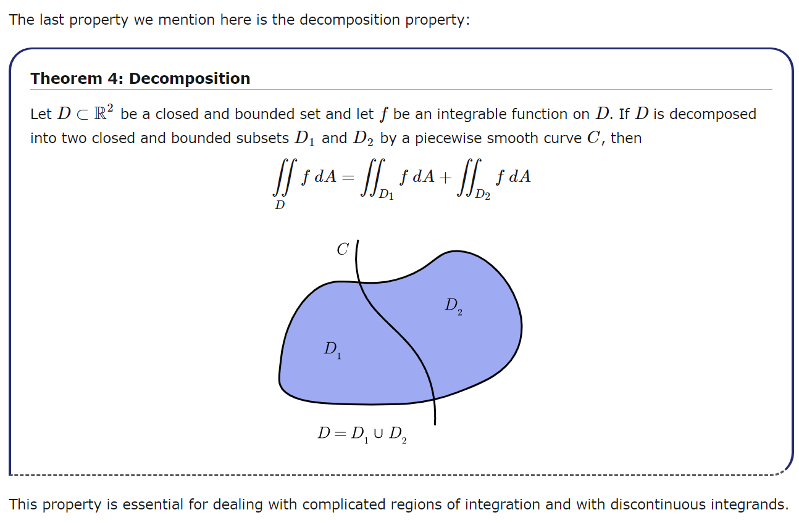

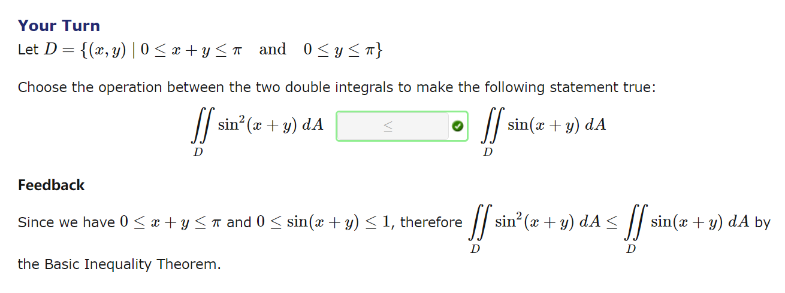

