# The Change of Variable Theorem

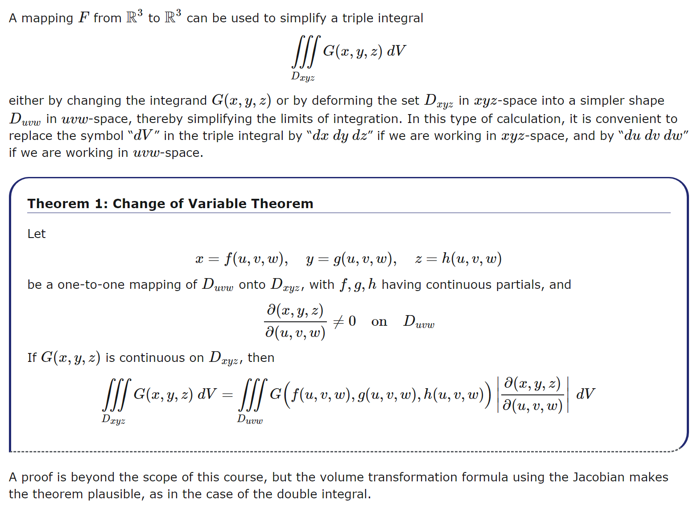

## Example 1

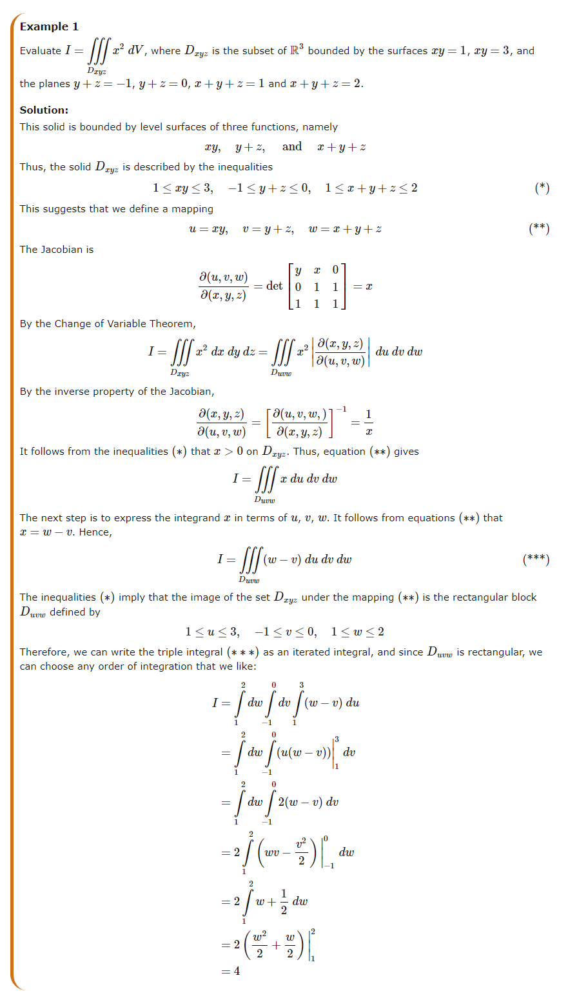

## Example 2

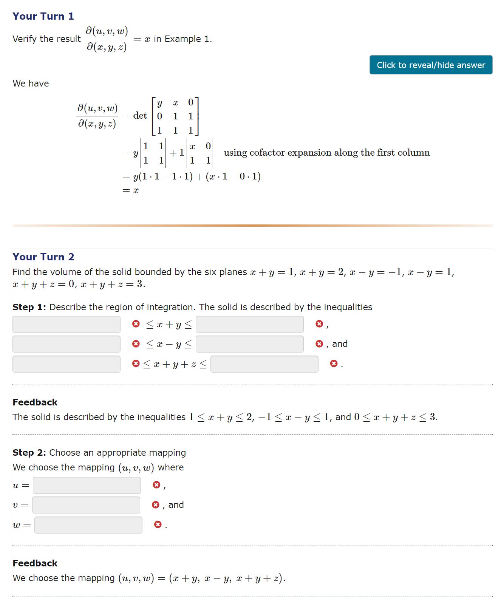

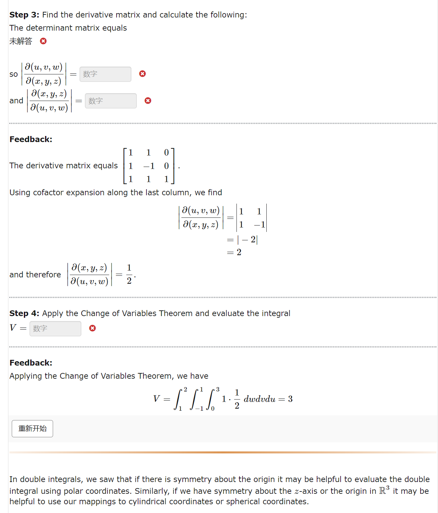

# Triple Integrals in Cylindrical Coordinates

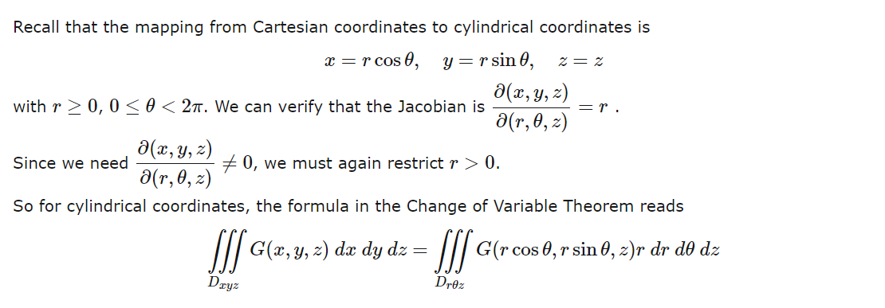

## Example 1

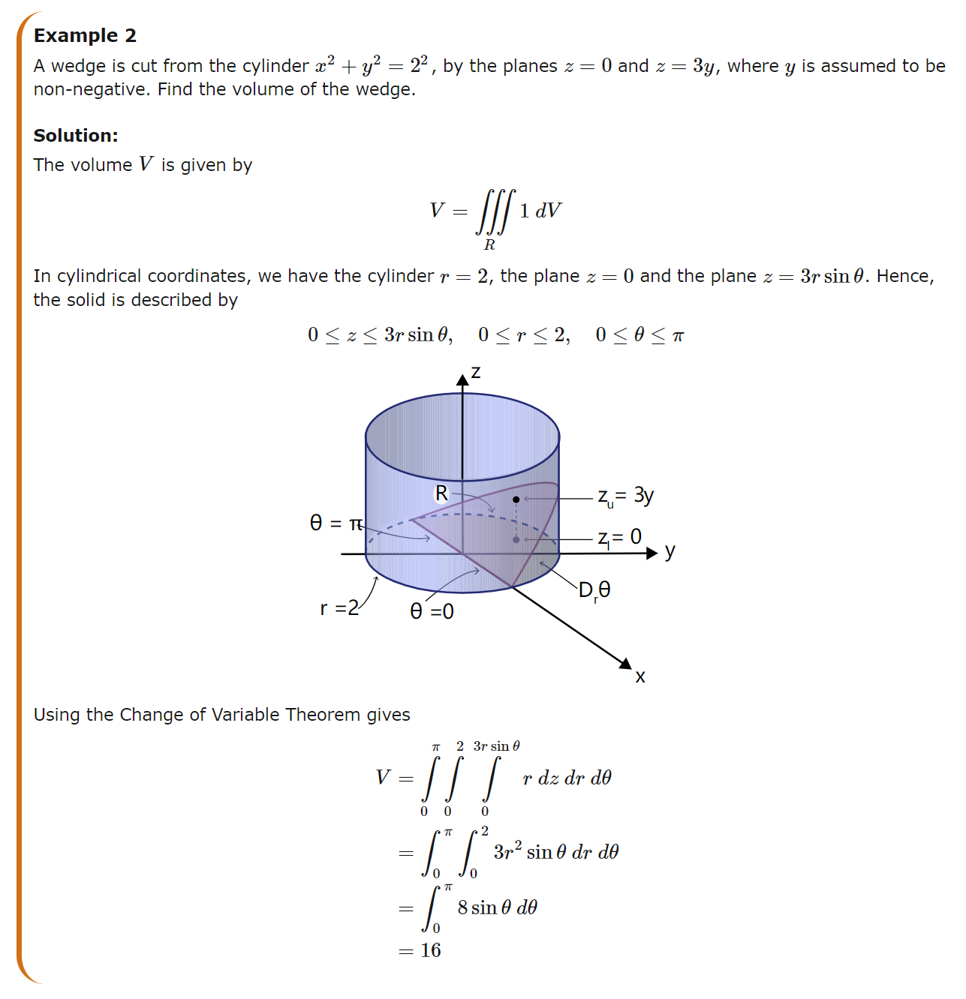

## Example 2

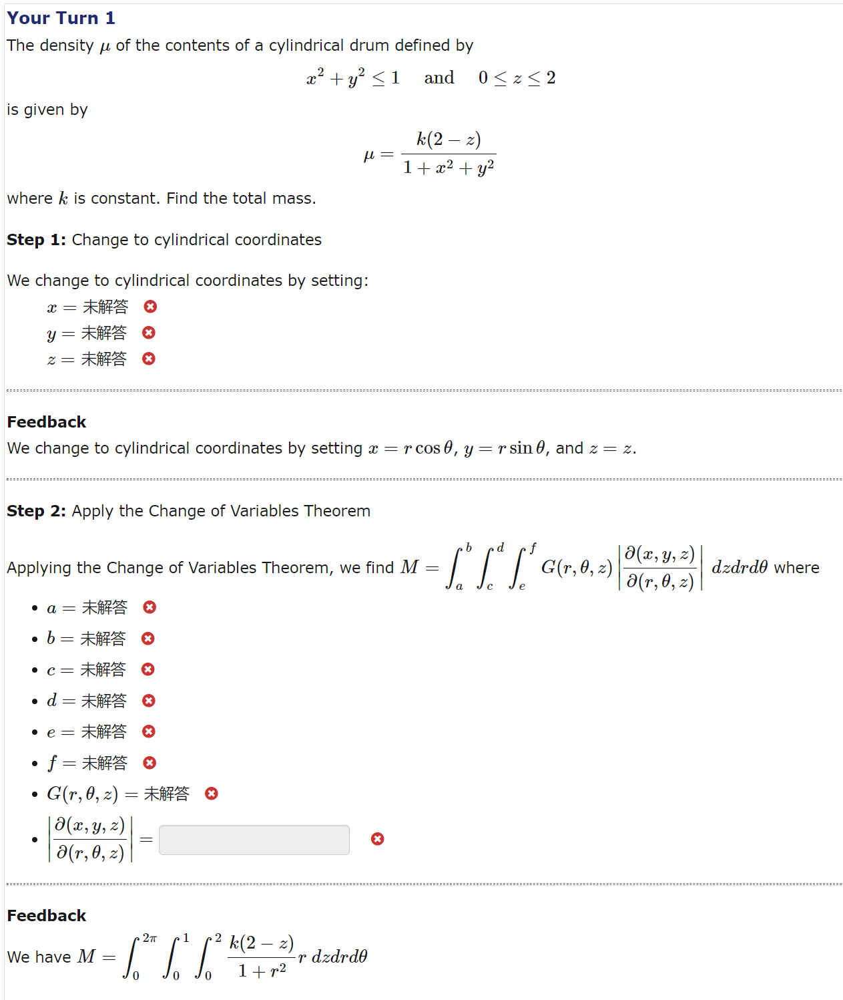

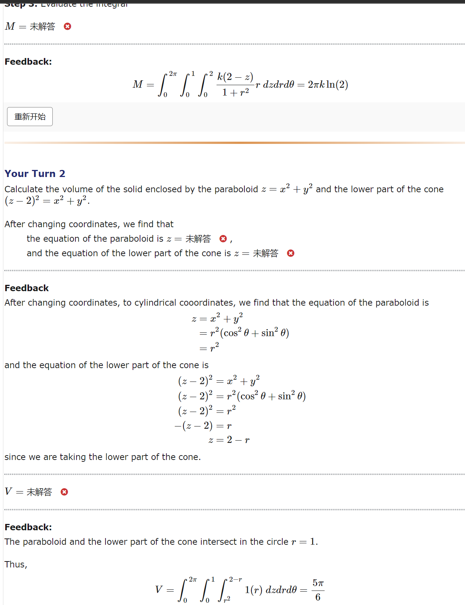

# Triple Integrals in Spherical Coordinates

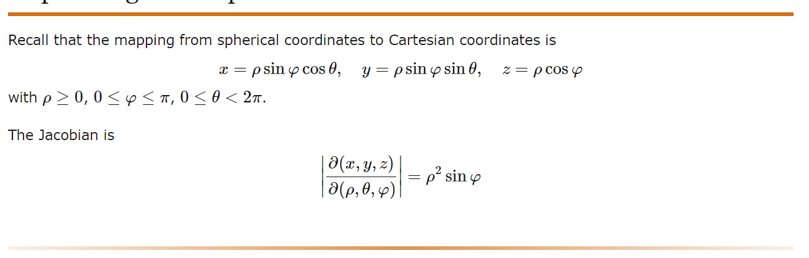

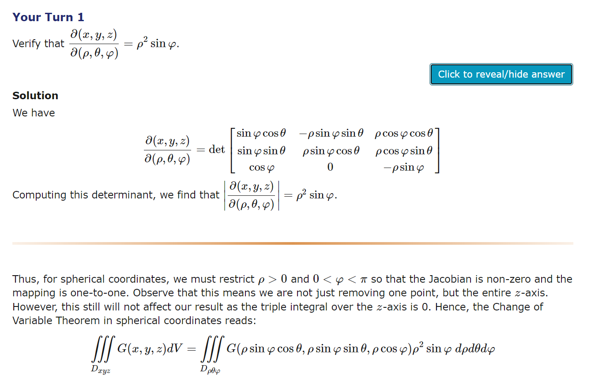

## Example 1

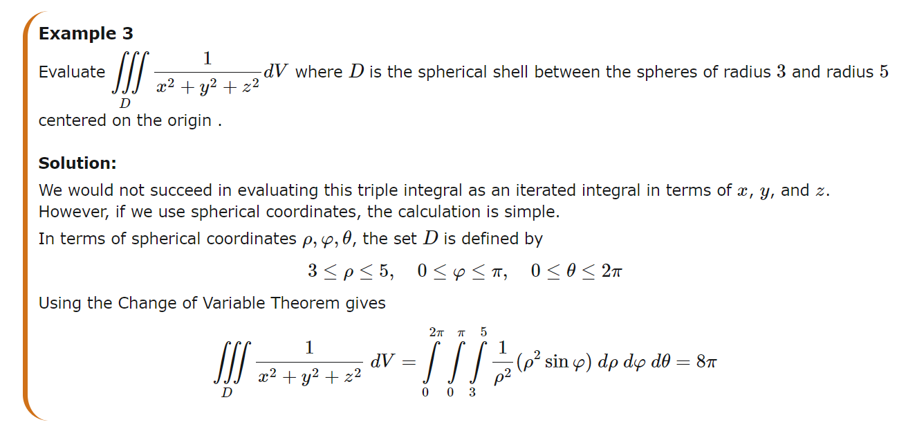

## Example 2

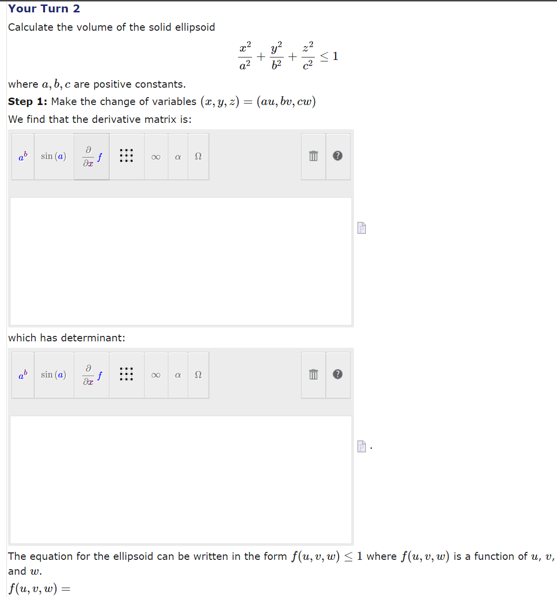

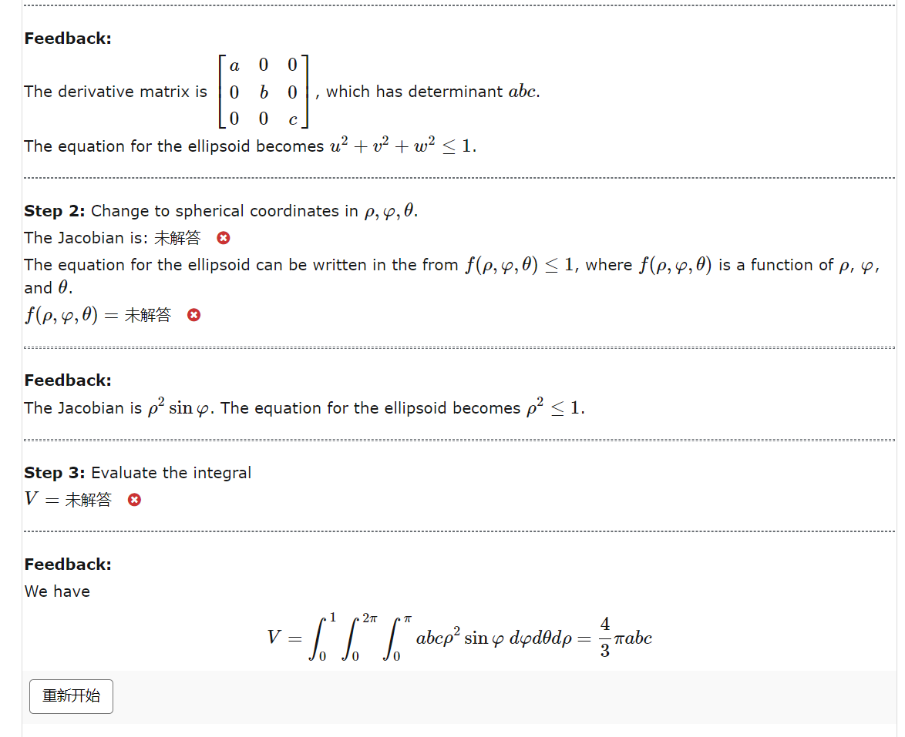

## Example 3

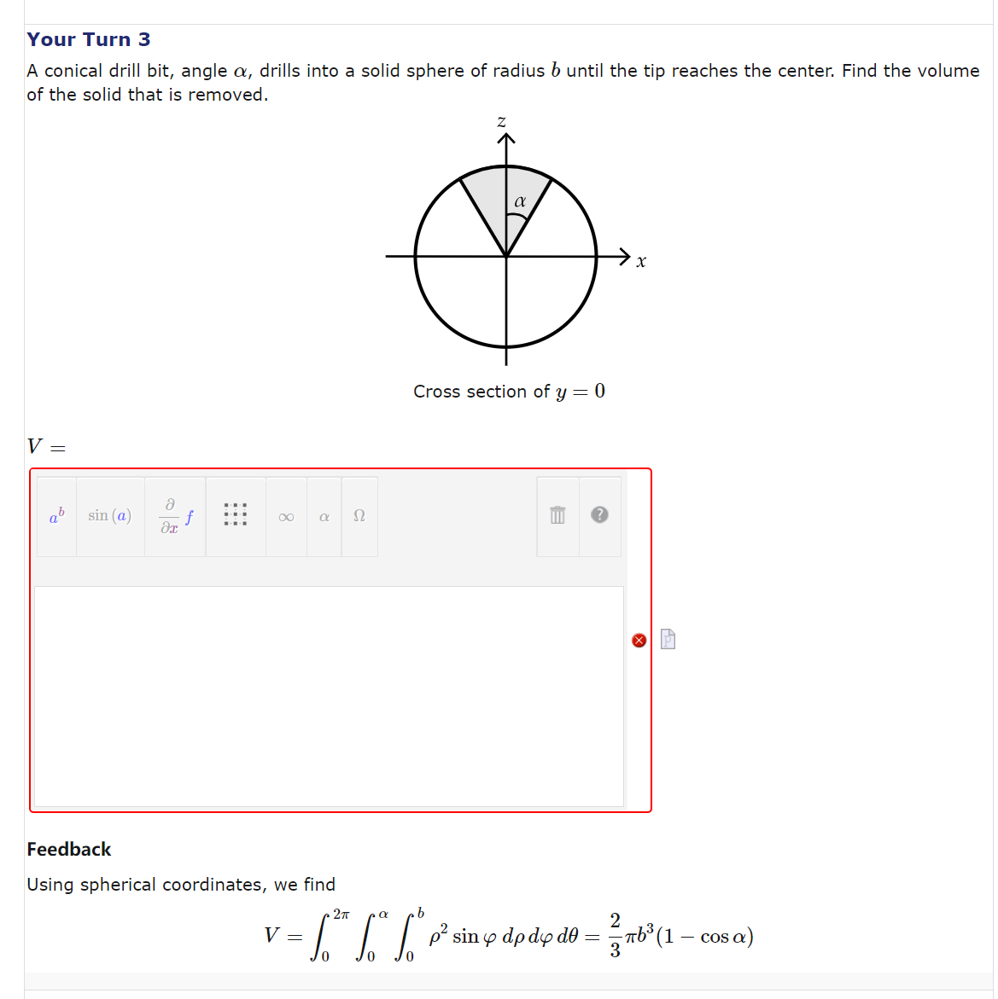